# 第一章 绪论

**1.1开发背景**

### 1.1.1 药店药品进销管理的基本特征

药店药品进销管理系统是专门针对医药零售行业特性设计的综合管理软件，与普通商品进销存系统相比，最核心的区别在于其严格的 GSP 合规性要求。系统必须全面符合《药品经营质量管理规范》及其附录要求，将质量控制功能内嵌于采购、收货、验收、储存、养护、销售、出库复核等所有业务环节，能够自动识别处方药与非处方药，强制执行处方药凭处方销售规定，支持药品全流程追溯，记录每一盒药品从供应商到消费者的完整流转轨迹，并自动生成符合药监要求的各类电子台账，支持一键导出监管所需的 PDF 报告。

药品具有明确的有效期，过期药品不仅造成经济损失，更可能引发严重的用药安全事故，因此精细化的批次与效期管理是药店系统的另一重要特征。系统采用 "一物一码" 技术，对每一批次药品进行唯一标识，强制遵循 "先进先出" 和 "效期优先" 的出库策略，当药品进入预警期时会通过弹窗、短信等方式自动提醒店员优先促销或退货，过期药品则会被系统自动锁定，禁止销售。

现代药店进销存系统实现了全流程一体化管理，整合了采购管理、库存管理、销售管理、财务管理、会员管理、质量管理等多个功能模块，实现了 "业务 - 财务 - 合规" 一体化。所有数据在同一数据库中流转，一次录入全流程同步，避免了多系统分立导致的数据重复录入和信息孤岛问题，例如销售完成后，系统会自动更新库存数据、生成销售凭证和财务报表，同时记录药品销售去向用于追溯。

系统还支持多门店、多仓库协同管理，库存数据实时同步，操作完成后同步延迟不超过 5 秒，店员可通过扫码查询任意门店的药品库存信息并一键发起调拨申请，总部能够实时监控所有门店的经营数据，统一进行采购、定价和营销活动管理。在安全方面，系统采用严格的权限控制机制，根据不同岗位设置不同的操作权限，确保员工仅能访问其职责范围内的数据，同时具备完善的审计日志功能，记录所有关键操作的操作人员、时间和内容，确保数据可追溯。此外，系统采用模块化设计，能够根据药店业务发展需求灵活添加功能模块，并支持与医保结算系统、电子处方流转平台、药品追溯平台等外部系统的集成。

### 1.1.2 药店药品进销管理系统的开发意义

随着我国医药零售行业的快速发展和监管要求的不断提高，传统的手工记账和 Excel 表格管理模式已难以适应现代药店的运营需求，开发和应用药店药品进销管理系统首先能够解决传统管理模式的痛点，大幅提升运营效率。在传统手工管理模式下，店员需要花费大量时间手写单据、核对账目、盘点库存，不仅效率低下，还极易因人为疏忽导致数据错误，引入进销存系统后，大部分重复性工作可由计算机自动完成，使店员从繁琐的事务性工作中解放出来，专注于为顾客提供专业的药事服务，据统计，使用系统后药店的日常运营效率可提升 60% 以上，盘点周期从原来的 3-5 天缩短至 1 天以内。

精准控制库存、降低经营成本是系统带来的另一重要价值。系统通过实时监控库存数量和销售速度，结合历史销售数据、季节因素、疾病流行趋势等，智能计算安全库存阈值，当库存低于阈值时自动生成采购建议，有效避免了畅销品断货和滞销品积压的问题。同时，系统的效期预警功能能够大幅降低药品过期损耗，某连锁药店引入系统后，效期损耗率从年均 6% 降至 1.2%，年节省成本超过 10 万元，此外系统还能优化资金周转，秦邦医药在使用数字化系统后，平均库存周转天数从 120 多天降至 100 天左右，释放了大量被占用的现金流。

系统通过全流程追溯和质量控制，能够有效保障药品质量与用药安全，确保每一盒药品的来源可查、去向可追、责任可究。当发生药品质量问题时，系统能在几分钟内锁定涉及的门店和库存批次，快速完成问题药品的召回工作，最大限度地减少对消费者健康的危害，同时系统内置的 AI 审方功能能够实时识别药物相互作用、配伍禁忌和超剂量用药等风险，为顾客提供安全的用药指导，降低用药事故的发生率。

近年来，国家药监局和医保局不断加强对医药零售行业的监管力度，GSP 认证、药品追溯、医保飞检等已成为常态化要求，2025 年底前所有药店必须完成全流程电子化追溯部署，专业的进销存系统能够自动生成符合监管要求的各类台账和报表，确保药店在监管检查时能够快速、准确地提供所需数据，避免因合规问题受到处罚，据统计，使用合规系统的药店 GSP 核查通过率可提升至 95% 以上。

最后，系统能够对销售数据、库存数据、会员数据等进行多维度的统计分析，生成直观的报表和图表，帮助药店管理者全面了解经营状况，支持科学决策。管理者可以根据数据分析结果，优化商品结构、制定营销策略、调整采购计划，从而提高药店的盈利能力和市场竞争力，例如通过分析会员消费数据，药店可以开展精准营销活动，提高会员忠诚度和复购率。

### 1.1.3 药店药品进销管理系统的发展趋势

随着云计算、人工智能、大数据、物联网、区块链等新一代信息技术的快速发展，以及医药零售行业数字化转型的加速推进，药店药品进销管理系统正呈现出多方面的发展趋势。云原生 SaaS 化已成为主流部署模式，传统的本地部署模式需要药店购买服务器、安装软件并进行日常维护，初始投入大、运维成本高，而云原生 SaaS 模式具有低初始投入、高运维灵活性、快速迭代升级等优势，越来越受到中小药店的青睐，据统计，2025 年云端 SaaS 型系统已占据 61.2% 的市场份额，较 2020 年提升了 29 个百分点，单体药店采用 SaaS 系统的平均成本为每年 3200 元 / 店，仅为传统本地部署系统的 1/25，未来随着云技术的不断成熟和安全性能的提升，SaaS 模式将进一步取代本地部署模式，成为药店系统的主流选择。

人工智能技术正在全面重塑药店进销存系统的功能和价值，AI 技术将深度融入智能补货、智能审方、智能用药推荐、智能营销、智能客服等各个业务环节。基于机器学习的智能补货算法能够更准确地预测药品需求，使库存周转效率提升 40%；AI 处方审核系统的错误率将降至 0.05% 以下；AI 医疗大模型能够根据顾客的病症和历史用药情况，智能推荐联合用药方案，并实时识别用药风险，未来 AI 将成为药店系统的 "大脑"，帮助药店实现从 "经验管理" 向 "数据驱动管理" 的转变。

物联网技术将与进销存系统深度融合，实现对药品全生命周期的实时监测。温湿度传感器将自动采集药品储存环境的温湿度数据，并实时上传至系统，当温湿度超出规定范围时，系统会自动报警并采取相应措施；RFID 标签将取代传统的条形码，实现药品的快速识别和批量盘点，盘点效率可提升 90% 以上；智能药柜将与系统无缝对接，实现 24 小时无人售药和药品库存的自动管理，据预测，2028 年无人药房市场规模将突破 90 亿元。

区块链技术具有去中心化、不可篡改、可追溯等特性，非常适合应用于药品追溯领域，未来基于区块链的药品追溯系统将实现药品从生产企业、批发企业、零售药店到消费者的全流程信息上链，确保追溯数据的真实性和完整性，消费者可以通过扫描药品追溯码，查询到药品的全部流转信息，放心购买药品，同时区块链技术还能有效防止假药流入市场，保障公众用药安全。

随着互联网医疗的发展和消费者购药习惯的改变，线上购药已成为重要的药品销售渠道，未来的药店进销存系统将全面支持线上线下一体化运营，实现 "线上下单、线下配送"、"线上下单、门店自提" 等多种销售模式，系统将整合线上商城、外卖平台、小程序等多个销售渠道，统一管理库存、订单、会员和财务数据，为消费者提供无缝的购物体验。

未来的药店系统将不再仅仅是一个进销存管理工具，而是会向综合健康服务平台延伸，集成慢病管理、健康监测、远程问诊、用药指导、家庭药箱管理等多种健康服务功能。例如，系统可以为慢性病患者建立健康档案，定期提醒患者服药和复查；通过连接智能穿戴设备，实时监测患者的健康数据；为患者提供个性化的健康管理方案，这种转型将帮助药店从单纯的药品销售商转变为居民的 "健康管家"，提升药店的服务价值和客户粘性。

随着医保 DRG/DIP 支付改革的全面落地和医保飞检的常态化，药店系统与医保系统的深度对接将成为必然趋势。未来的系统将实现进销存数据与医保结算数据的实时同步，自动完成医保对账和费用申报；内置医保智能审核功能，实时识别医保违规行为，避免医保扣款风险；支持医保电子凭证、人脸识别等多种医保结算方式，为参保群众提供更加便捷的购药服务。

## 1.2 可行性分析

### 1.2.1 经济可行性分析

经济可行性分析主要通过评估项目的开发成本与预期收益，判断项目是否具备经济上的合理性与投资价值。药店药品进销管理系统的成本主要包括开发成本和运营成本两部分，开发成本涵盖软件开发人员薪酬、开发工具与软件授权费用、服务器及硬件设备采购费用等，对于中小型单体药店或小型连锁药店而言，采用模块化开发方式可有效控制开发成本，且系统开发完成后可长期使用，一次性投入能够获得持续回报。运营成本主要包括系统日常维护费用、软件升级费用以及员工培训费用，相较于传统手工管理模式下的人力成本、药品损耗成本及合规罚款成本，系统的运营成本极低且可控。

从收益角度来看，系统的应用能够为药店带来显著的直接经济效益和间接经济效益。直接经济效益方面，系统的精细化批次与效期管理功能可大幅降低药品过期损耗，据行业统计数据，引入专业进销存系统后，药店的药品效期损耗率可从传统模式下的年均 6% 降至 1.2% 左右，按一家年销售额 500 万元的单体药店计算，每年可节省药品损耗成本约 24 万元。同时，系统的智能库存管理功能能够优化库存结构，避免畅销品断货和滞销品积压，将平均库存周转天数从 120 天左右缩短至 100 天以内，释放大量被占用的流动资金。此外，系统的自动化处理能力可将药店的日常运营效率提升 60% 以上，盘点周期从 3-5 天缩短至 1 天以内，大幅减少了人工成本支出。间接经济效益方面，系统能够帮助药店满足 GSP 合规要求，避免因合规问题受到的罚款处罚，同时通过精准的会员管理和营销功能提升顾客忠诚度和复购率，进一步增加药店的销售收入。综合来看，药店药品进销管理系统的投入产出比极高，通常在系统上线后 6-12 个月即可收回全部开发成本，具备良好的经济可行性。

### 1.2.2 技术可行性分析

技术可行性分析主要评估现有技术条件是否能够满足系统的功能需求和性能要求，以及开发团队是否具备完成项目开发的技术能力。本系统采用目前 Java 开发领域最成熟、最主流的技术组合进行开发，整体架构以 SpringBoot 为核心后端框架，搭配 MySQL 关系型数据库，使用 IntelliJ IDEA 作为集成开发环境，同时配合 Git 进行版本控制、Navicat 进行数据库管理。该技术栈经过了大量商业项目的验证，具有开发效率高、稳定性强、维护成本低、生态完善等显著优势，完全能够满足中小型药店药品进销管理系统的功能需求和性能要求。

SpringBoot 作为本系统的核心框架，彻底解决了传统 Spring 框架配置繁琐、依赖管理复杂的问题。其 "约定大于配置" 的设计理念提供了自动配置机制，能够根据项目引入的依赖自动完成环境配置，大幅减少了开发人员的配置工作量；起步依赖功能可以自动管理相关依赖的版本，有效避免了版本冲突问题；内嵌 Tomcat、Jetty 等 Web 服务器，无需单独安装配置服务器，简化了系统的部署和运行流程。同时，SpringBoot 完整继承了 Spring 生态的所有优势，支持 SpringMVC 实现 MVC 分层架构，清晰分离系统的表现层、业务逻辑层和数据访问层，提高了系统的可维护性和扩展性；支持 Spring Data JPA 等持久层框架，能够大幅简化数据库操作；提供了完善的事务管理机制，确保药品入库、出库、销售结算等关键业务操作的数据一致性和完整性。此外，SpringBoot 具有极强的集成能力，能够方便地对接医保结算系统、电子处方流转平台、药品追溯平台等外部系统，为药店未来的业务拓展提供了技术支撑。

MySQL 作为本系统的数据库管理系统，是中小型企业信息系统的首选数据库解决方案。MySQL 具有开源免费、性能稳定、易于部署和维护等优点，对于年销售额在 500 万元以内的中小型药店而言，其数据量通常在百万级以内，MySQL 完全能够满足其数据存储和高并发查询需求。MySQL 支持 ACID 事务特性，能够保证药品出入库、库存调整、销售退款等关键操作的原子性，防止出现数据不一致的问题；提供了完善的索引机制和查询优化功能，能够快速响应库存查询、销售统计、订单追溯等高频操作；支持多种存储引擎，可根据不同业务场景选择合适的存储引擎优化性能。同时，MySQL 与 SpringBoot 框架具有极佳的兼容性，通过 Spring Data JPA 或 MyBatis 等持久层框架可以实现数据的无缝交互，大幅提高数据库操作的开发效率。

IntelliJ IDEA 作为本系统的集成开发环境，是目前 Java 开发领域功能最强大、最受欢迎的 IDE 之一。IDEA 对 SpringBoot 提供了原生的深度支持，能够自动识别 SpringBoot 项目结构，提供一键运行、热部署、自动重启等功能，大大缩短了开发调试周期；其智能代码提示、自动补全、代码重构、语法检查等功能能够帮助开发人员编写高质量的代码，减少编码错误；集成了 Git 版本控制工具，支持代码提交、分支管理、合并冲突解决等操作，方便团队协作开发；内置了强大的调试工具，支持断点调试、变量监控、表达式求值等功能，能够帮助开发人员快速定位和解决问题。此外，IDEA 还提供了丰富的插件生态，可通过安装插件扩展数据库管理、接口测试、代码质量分析等功能，进一步提升开发效率。

从系统功能实现的角度来看，本系统的核心功能包括库存管理和销售管理两大模块，其中库存管理模块涵盖药品入库、出库、盘点、预警、批次效期管理等功能，销售管理模块涵盖前台开单、订单追溯、处方药合规管理、医保与会员管理、销售退货等功能。这些功能在医药零售行业的信息化系统中已经有非常成熟的实现方案，相关的技术难点如 GSP 合规流程控制、药品批次与效期的精细化管理、"先进先出、近效期先出" 出库策略的实现、医保系统对接等都已有大量的开源案例和技术文档可供参考。例如，通过 SpringBoot 的定时任务功能可以实现药品效期的每日自动扫描和预警；通过数据库事务和行级锁可以保证药品出入库操作的并发安全性；通过 SpringMVC 的拦截器可以实现处方药销售的权限控制和合规校验；通过 SpringBoot 的 RESTful API 可以方便地与前端界面进行数据交互。开发团队已经完成了系统的需求分析、概要设计和详细设计工作，绘制了完整的数据流图、用例图、类图和时序图，明确了各模块的功能边界和数据交互关系，技术路线清晰明确。

开发团队具备扎实的 Java 开发基础和数据库设计能力，熟悉 SpringBoot 框架的核心特性和使用方法，能够熟练运用 SpringMVC、Spring Data JPA 等组件进行系统开发。团队成员掌握 MySQL 数据库的表结构设计、索引优化、事务管理等核心技术，能够设计出符合业务需求且性能优良的数据库方案。同时，团队成员能够熟练使用 IntelliJ IDEA 开发工具，配合 Git 进行版本控制，具备良好的代码规范和团队协作能力。此外，开发团队通过查阅相关技术文档和行业案例，已经对医药零售行业的业务流程和 GSP 合规要求有了深入的了解，能够准确把握系统的核心需求，确保系统的功能符合药店的实际运营需要。

综上所述，本系统采用的 SpringBoot+MySQL+IntelliJ IDEA 技术组合成熟稳定，具有开发效率高、维护成本低、扩展性强等优点。核心功能的实现方案已经得到充分验证，不存在无法克服的技术难题。开发团队具备完成项目开发所需的技术能力和业务知识，能够按时、高质量地完成系统的开发和测试工作。因此，本系统在技术上是完全可行的。

### 1.2.3 社会可行性分析

社会可行性分析主要评估项目是否符合国家法律法规和行业政策要求，是否能够被目标用户所接受，以及是否具有良好的社会效益。从政策环境来看，近年来国家药监局和医保局不断加强对医药零售行业的监管力度，《药品经营质量管理规范》（GSP）明确要求药店必须建立完善的药品质量管理体系，实现药品全流程可追溯，2025 年底前所有药店必须完成全流程电子化追溯部署。同时，国家大力推动医药零售行业的数字化转型，鼓励药店运用信息技术提升管理水平和服务能力，这些政策为药店药品进销管理系统的推广和应用提供了良好的政策环境和市场需求。

从法律层面来看，本系统的开发和使用严格遵守国家相关法律法规，所有开发工具和软件均采用正版授权，系统源代码为自主开发，拥有完全的自主知识产权。系统涉及的第三方接口如医保结算接口、电子处方流转接口等，均通过正规渠道进行对接，不存在法律纠纷。同时，系统严格遵循《中华人民共和国药品管理法》《个人信息保护法》等法律法规的要求，对药品数据和用户个人信息进行严格的安全保护，确保数据的保密性、完整性和可用性。

从用户接受度来看，随着医药零售行业的发展和监管要求的提高，传统的手工记账和 Excel 表格管理模式已经无法满足药店的运营需求，药店经营者对专业的进销存管理系统有着强烈的需求。本系统的设计充分考虑了药店工作人员的操作习惯，界面简洁友好，操作流程简单直观，不需要对使用者进行复杂的专业培训，普通药店员工经过 1-2 天的培训即可熟练掌握系统的操作。此外，系统能够切实解决药店在运营过程中遇到的库存管理混乱、药品过期损耗严重、合规难度大等痛点问题，能够显著提升药店的运营效率和管理水平，因此能够得到广大药店经营者和工作人员的认可和接受。

从社会效益来看，药店药品进销管理系统的应用能够有效保障药品质量和用药安全，通过全流程追溯和质量控制，确保每一盒药品的来源可查、去向可追、责任可究，最大限度地减少假药、劣药流入市场，保护消费者的身体健康。同时，系统的推广应用能够推动整个医药零售行业的数字化转型，提升行业的整体管理水平和服务质量，促进医药零售行业的健康发展。

### 1.2.4 可行性分析总结

综上所述，药店药品进销管理系统在经济、技术和社会三个方面都具备充分的可行性。在经济上，系统投入产出比高，能够为药店带来显著的经济效益，短期内即可收回开发成本；在技术上，采用成熟稳定的技术栈，相关功能已有成熟的实现方案，开发团队具备完成项目的技术能力；在社会上，符合国家政策导向和行业监管要求，法律风险低，用户接受度高，具有良好的社会效益。本系统的开发目标明确，需求清晰，技术路线可行，风险可控，能够满足中小型药店的实际运营需求，具有较高的实用价值和推广意义，因此项目的开发是完全可行的。

# 第二章 开发环境

## 2.1 开发环境总览

在药店药品进销管理系统的技术选型和系统框架设计过程中，为了提高系统的可扩展性、可维护性和开发效率，同时兼顾中小型药店的部署成本和运维难度，本系统采用成熟稳定的 Java 技术栈进行开发，整体遵循 MVC（Model-View-Controller）设计模式，实现表现层、业务逻辑层和数据访问层的清晰分离。

本系统的具体开发与运行环境配置如下：

1.  操作系统：采用 Windows 11 64 位操作系统，浏览器使用 Google Chrome、Microsoft Edge等主流浏览器进行前端页面测试与调试。

2.  开发工具：以 IntelliJ IDEA 2024.2 作为核心集成开发环境，配Navicat Premium 16 进行数据库可视化管理，使用Git 2.45进行版本控制。

3.  核心技术栈：后端采用SpringBoot 3.2.5框架，整SpringMVC 实现Web层功能，使用 MyBatis 3.5.15作为持久层框架；数据库采用MySQL 8.0.36关系型数据库；JDK版本为OpenJDK 17。

4.  应用服务器：利用SpringBoot内嵌的Apache Tomcat 10.1作为Web服务器，无需单独安装配置，简化系统部署流程。

## 2.2 主要技术

### 2.2.1 IntelljIDEA

IntelliJ IDEA 是 JetBrains 公司推出的 Java 语言集成开发环境，凭借其强大的智能代码辅助、完善的调试工具和丰富的插件生态，成为目前 Java 开发领域最主流的 IDE。本系统选择 IntelliJ IDEA 作为开发工具，主要基于其对 SpringBoot 框架的原生深度支持，能够自动识别 SpringBoot 项目结构，提供一键运行、热部署、自动重启等功能，大幅缩短开发调试周期。

在本项目开发过程中，IDEA 的智能代码提示、自动补全、代码重构和语法检查功能帮助开发人员编写高质量代码，减少编码错误；其内置的 Git 集成工具支持代码提交、分支管理、合并冲突解决等操作，方便团队协作开发；强大的断点调试功能支持变量监控、表达式求值和堆栈跟踪，能够快速定位和解决业务逻辑中的问题。此外，通过安装 Database Tools、Lombok、MyBatis Log 等插件，进一步扩展了数据库管理、代码简化和 SQL 日志分析等功能，全面提升了开发效率。

### 2.2.2 SpringBoot框架

SpringBoot 是基于 Spring 框架开发的快速开发脚手架，其核心设计理念是 "约定大于配置"，彻底解决了传统 Spring 框架配置繁琐、依赖管理复杂的问题。本系统采用 SpringBoot 作为核心后端框架，通过自动配置机制能够根据项目引入的依赖自动完成环境配置，无需手动编写大量 XML 配置文件；起步依赖功能可以自动管理相关依赖的版本，有效避免了版本冲突问题。

SpringBoot 完整继承了 Spring 生态的所有优势，本系统通过整合 SpringMVC 实现 MVC 分层架构，清晰分离系统的表现层、业务逻辑层和数据访问层，提高了系统的可维护性和扩展性；整合 MyBatis 持久层框架，简化了数据库操作，提高了数据持久化的效率；提供了完善的声明式事务管理机制，确保药品入库、出库、销售结算等关键业务操作的数据一致性和完整性。同时，SpringBoot 内嵌 Tomcat 服务器，使系统可以打包为独立的 JAR 文件直接运行，极大简化了系统的部署和运维流程，非常适合中小型药店的实际使用场景。

### 2.2.3 内嵌TomcatWeb服务器

Tomcat 是 Apache 软件基金会 Jakarta 项目中的核心项目，是目前最流行的开源 Java Web 服务器之一，具有轻量级、高性能、兼容性好等特点。本系统采用 SpringBoot 内嵌的 Tomcat 10.1 作为 Web 服务器，无需单独下载、安装和配置Tomcat环境，也无需将项目打包为 WAR 文件部署到外部服务器，只需将项目打包为可执行JAR文件，即可在安装了 JDK 的服务器上直接运行。

这种部署方式不仅大幅降低了系统的部署难度和运维成本，还避免了外部Tomcat版本与项目依赖不兼容的问题。同时，SpringBoot允许通过配置文件灵活调整Tomcat的端口号、连接数、超时时间等参数，满足不同药店的业务需求。对于有特殊需求的场景，系统也支持打包为WAR文件部署到外Tomcat服务器，具有良好的部署灵活性。

### 2.2.4 MySQL

MySQL 是 Oracle 公司旗下的开源关系型数据库管理系统，具有开源免费、性能稳定、易于部署和维护等优点，是中小型企业信息系统的首选数据库解决方案。本系统选择 MySQL 8.0 作为数据库管理系统，主要基于其能够完全满足中小型药店的数据存储和查询需求——对于年销售额在 500 万元以内的单体药店，其药品信息、库存记录、销售订单、会员信息等数据量通常在百万级以内，MySQL 的性能完全能够支撑。

MySQL 支持 ACID 事务特性，能够保证药品出入库、库存调整、销售退款等关键操作的原子性，防止出现数据不一致的问题；提供了完善的索引机制和查询优化功能，能够快速响应库存查询、销售统计、订单追溯等高频操作；支持行级锁和表级锁，能够有效处理多用户并发操作的场景。同时，MySQL 与 SpringBoot 框架具有极佳的兼容性，通过 MyBatis 持久层框架可以实现数据的无缝交互，大幅提高数据库操作的开发效率。

### 2.2.5 Git版本控制系统

Git 是目前最流行的分布式版本控制系统，相较于传统的集中式版本控制系统（如 SVN），Git 具有分支管理灵活、本地版本库完整、协作效率高等优势。本系统采用 Git 进行版本控制，配合 Gitee 代码托管平台实现代码的远程存储和团队协作。

在项目开发过程中，开发人员可以在本地创建独立的功能分支进行开发，完成后再合并到主分支，避免了不同功能开发之间的相互干扰；Git 完整记录了每一次代码提交的历史信息，包括提交人、提交时间和修改内容，便于代码的追溯和问题排查；当出现代码错误时，可以快速回滚到之前的稳定版本，降低开发风险。同时，Git 支持多人并行开发，通过分支合并和冲突解决功能，能够高效协调团队成员的开发工作，确保项目开发进度。

# 第三章 需求分析

## 3.1 库存管理模块需求分析

库存管理是药店药品进销管理系统的核心环节，直接影响药店的运营效率、资金周转及药品供应的及时性。由于药品具有特殊性（如有效期、批号管理、合规性要求等），精准的库存管理不仅能避免药品积压或短缺，还能确保药品质量安全，符合医药行业监管要求。该模块涵盖药品入库、出库、盘点、预警等关键功能，为药店的库存运营提供全面支撑。

**3.1.1 药品入库管理**

药品入库是库存数据增加的唯一合法途径，也是确保药品质量进入药店的第一道关卡。由于药品需严格遵循“先进先出”、批号追溯等原则，入库管理需对药品的来源、资质、数量、效期等信息进行精准登记与核验。系统支持采购入库、退货入库（如顾客退回合格药品）等多种入库场景，需关联供应商信息、采购订单，确保入库流程可追溯。具体功能包括入库单创建、药品基础信息与批次信息录入（批号、生产日期、有效期、生产厂家等）、入库数量核对、资质文件上传（如药品检验报告）、入库单审核与确认、库存数据自动更新等。

**3.1.2 药品出库管理**

药品出库是库存数据减少的核心环节，需严格管控以避免错发、漏发，确保药品流向可追溯。药店出库主要包括销售出库（关联前台销售订单）、调拨出库（如门店间药品调配）、报损出库（如过期、破损药品处理）等场景。出库时需遵循“先进先出”、“近效期先出”原则，优先发放临近有效期的药品，减少药品损耗。系统功能包括出库单创建（关联销售/调拨/报损单据）、库存药品批次锁定、出库数量核验、出库单审核与确认、库存数据自动扣减、出库记录留存与查询等。

**3.1.3 库存盘点管理**

库存盘点是确保药店库存“账实相符”的关键手段，由于药品可能存在自然损耗、过期、丢失等情况，需定期或不定期对库存进行盘点。系统支持全盘（对所有库存药品进行清点）和抽盘（对特定药品、批次或货架进行清点）两种方式，需记录盘点时间、盘点人、实际库存与系统库存的差异。具体功能包括盘点单创建、盘点任务分配、库存数据快照生成（锁定盘点时的系统库存）、实际库存数量录入、盘点差异自动计算、差异原因说明与审核、库存数据调整（经审批后根据实际库存更新系统数据）、盘点记录归档与查询等。

**3.1.4 库存预警管理**

库存预警是防范药品积压、短缺及过期风险的重要功能，针对药品的特殊性，需设置多维度预警机制。通过预设阈值，系统可实时监控库存状态，及时向管理人员推送预警信息，避免因库存问题影响销售或造成资金浪费。具体功能包括最低库存预警（当药品库存低于预设阈值时，提示及时补货）、最高库存预警（当药品库存高于预设阈值时，提示控制采购，避免积压）、近效期药品预警（对距离有效期不足预设天数的药品进行提示，便于促销或调拨）、过期药品预警（对已过有效期的药品进行锁定，禁止销售，并提示报损处理）、预警信息推送（通过系统消息、弹窗等方式通知相关人员）等。

**3.1.5 药品批次与效期管理**

药品的批次与效期管理是医药行业的核心合规要求，需确保每一批次药品的来源、流向、效期可追溯。系统需对药品进行“一物一批号”管理，同一药品的不同批次需分别记录库存数量、效期等信息，出库时自动匹配符合“先进先出”“近效期先出”原则的批次。具体功能包括药品批次信息建档（关联入库单、供应商、检验报告等）、批次库存独立核算、效期自动计算与更新、批次追溯查询（可通过药品名称、批号查询入库、出库、库存等全流程信息）、过期批次自动锁定、批次库存盘点等。

**3.1.6 库存查询与统计分析**

库存查询与统计分析是帮助管理人员掌握库存动态、优化库存结构的重要工具。通过多维度的查询和可视化的统计报表，可快速了解库存现状，为采购、销售决策提供数据支撑。具体功能包括实时库存查询（支持按药品名称、编码、批号、效期、货架等条件筛选）、库存流水查询（查询某一时间段内药品的入库、出库、盘点等变动记录）、库存统计报表（如库存周转率统计、库存结构分析（按药品类别、效期分布）、积压药品统计、近效期药品统计等）、报表导出（支持Excel、PDF等格式）、数据可视化展示（如柱状图、折线图呈现库存变动趋势）等。

## 3.2系统模块详解

**3.2.1库存管理模块功能模块**

### 3.2.1.1库存管理模块0层数据流图

整个库存管理模块的数据流图如图3.1所示：

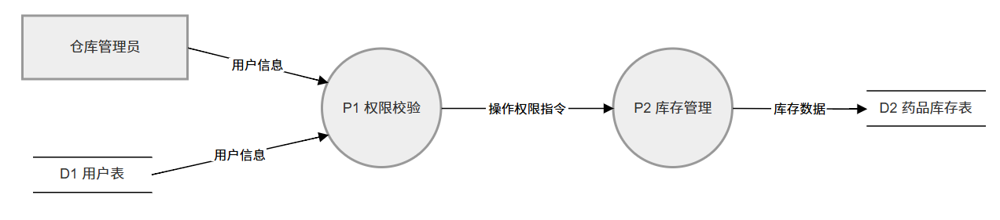

图3.1 库存管理模块数据流图

### 3.2.1.2细化后的1层数据流图

在所有的数据处理过程中，P2 处理过程最为核心，它根据仓库管理员的实际业务操作分成三种核心场景，根据需求，细化后的 1 层数据流图如图 3.2、图 3.3、图 3.4 所示：

1\. 药品入库1层数据流图

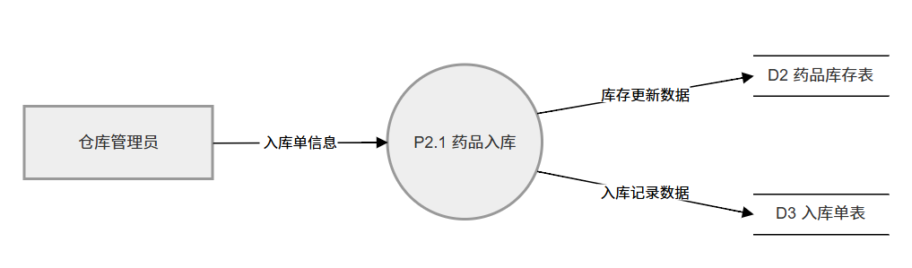

图3.2 P2细化后药品入库数据流图

2.药品出库1层数据流图

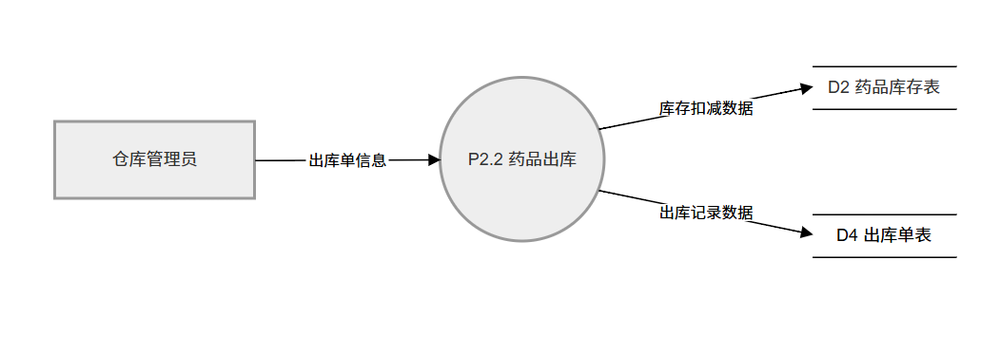

图3.3 P2细化后药品出库数据流图

3.商品检索1层数据流

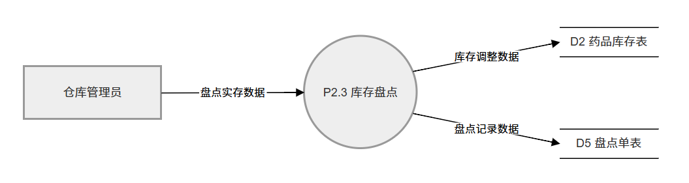

图3.4 P2细化后库存盘点数据流图

### 3.2.1.3 数据流描述

表3.1 用户信息数据流

| 模块名称                                                                                                    | 库存管理 | 编号 | F1  |
|-------------------------------------------------------------------------------------------------------------|----------|------|-----|
| 名称                                                                                                        | 用户信息 |      |     |
| 来源：用户表                                                                                                |          |      |     |
| 去处：进行权限校验和库存业务操作                                                                            |          |      |     |
| 数据流结构：用户信息 ={用户名 + 用户密码 + 用户编号 + 用户姓名 + 岗位 + 联系方式 + 权限等级 + 所属门店}     |          |      |     |
| 简要说明： 这些信息是仓库管理人员的必要信息，用于操作人员的身份登录验证、操作权限分配与库存业务操作权限校验 |          |      |     |

表3.2 入库单信息数据流

| 模块名称                                                                                                                                               | 库存管理   | 编号 | F2  |
|--------------------------------------------------------------------------------------------------------------------------------------------------------|------------|------|-----|
| 名称                                                                                                                                                   | 入库单信息 |      |     |
| 来源：仓库管理员 / 供应商                                                                                                                              |            |      |     |
| 去处：药品入库处理、入库单表、药品库存表                                                                                                               |            |      |     |
| 数据流结构：入库单信息 ={入库单编号 + 药品编号 + 药品名称 + 规格 + 单位 + 数量 + 批号 + 生产日期 + 有效期 + 供应商编号 + 入库日期 + 操作人 + 审核状态} |            |      |     |
| 简要说明：包含药品入库的全量核心信息，用于入库单创建、审核、库存数量更新，同时实现药品入库全流程可追溯                                                 |            |      |     |

表3.3 出库单信息数据流

| 模块名称                                                                                                                                        | 库存管理   | 编号 | F3  |
|-------------------------------------------------------------------------------------------------------------------------------------------------|------------|------|-----|
| 名称                                                                                                                                            | 出库单信息 |      |     |
| 来源：仓库管理员 / 销售系统                                                                                                                     |            |      |     |
| 去处：药品出库处理、出库单表、药品库存表                                                                                                        |            |      |     |
| 数据流结构：出库单信息 ={出库单编号 + 药品编号 + 药品名称 + 规格 + 单位 + 数量 + 批号 + 关联销售单号 + 出库类型 + 出库日期 + 操作人 + 审核状态} |            |      |     |
| 简要说明：包含药品出库的全量核心信息，用于出库单创建、审核、库存数量扣减，严格遵循 “先进先出、近效期先出” 原则，实现药品出库流向可追溯          |            |      |     |

表3.4 盘点单信息数据流

| 模块名称                                                                                                                                      | 库存管理   | 编号 | F4  |
|-----------------------------------------------------------------------------------------------------------------------------------------------|------------|------|-----|
| 名称                                                                                                                                          | 盘点单信息 |      |     |
| 来源：仓库管理员                                                                                                                              |            |      |     |
| 去处：药品入库处理、入库单表、药品库存表                                                                                                      |            |      |     |
| 数据流结构：盘点单信息 ={盘点单编号 + 药品编号 + 药品名称 + 系统库存数量 + 实际库存数量 + 差异数量 + 差异原因 + 盘点日期 + 盘点人 + 审核状态} |            |      |     |
| 简要说明：包含库存盘点的全量核心信息，用于账实核对、差异分析、库存数据调整，确保系统库存与实际库存一致                                        |            |      |     |

表3.5 库存预警信息数据流

| 模块名称                                                                                                         | 库存管理     | 编号 | F5  |
|------------------------------------------------------------------------------------------------------------------|--------------|------|-----|
| 名称                                                                                                             | 库存预警信息 |      |     |
| 来源：库存预警处理                                                                                               |              |      |     |
| 去处：仓库管理员                                                                                                 |              |      |     |
| 数据流结构：库存预警信息 ={药品编号 + 药品名称 + 预警类型 + 预警内容 + 触发时间 + 处理状态}                      |              |      |     |
| 简要说明：包含库存异常的提醒信息，覆盖低库存、高库存、近效期、过期药品四类预警，用于提醒管理人员及时处理库存风险 |              |      |     |

表3.6 库存查询统计请求数据流

| 模块名称                                                                                                   | 库存管理         | 编号 | F6  |
|------------------------------------------------------------------------------------------------------------|------------------|------|-----|
| 名称                                                                                                       | 库存查询统计请求 |      |     |
| 来源：仓库管理员 / 财务系统                                                                                |                  |      |     |
| 去处：库存查询统计处理                                                                                     |                  |      |     |
| 数据流结构：查询统计请求 ={查询条件 + 统计维度 + 时间范围 + 导出需求}                                      |                  |      |     |
| 简要说明：包含库存数据查询、统计、报表生成的请求信息，用于精准获取库存流水、库存结构、库存周转率等相关数据 |                  |      |     |

表3.7 库存查询统计结果数据流

| 模块名称                                                                                | 库存管理         | 编号 | F6  |
|-----------------------------------------------------------------------------------------|------------------|------|-----|
| 名称                                                                                    | 库存查询统计结果 |      |     |
| 来源：库存查询统计处理                                                                  |                  |      |     |
| 去处：仓库管理员 / 财务系统                                                             |                  |      |     |
| 数据流结构：查询统计结果 ={药品库存信息 + 出入库流水记录 + 盘点记录 + 库存统计报表数据} |                  |      |     |
| 简要说明：包含查询统计的返回结果，为库存优化、采购决策、财务对账、合规审计提供数据支撑  |                  |      |     |

### 3.2.1.4 数据存储描述

表3.8 用户表数据存储

| 模块名称                                                                                               | 商品管理 | 编号 | D1  |
|--------------------------------------------------------------------------------------------------------|----------|------|-----|
| 名称                                                                                                   | 用户表   |      |     |
| 组织形式：按用户编号顺序排练                                                                           |          |      |     |
| 关键字：用户编号                                                                                       |          |      |     |
| 记录组成：{用户编号 + 用户名 + 登录密码 + 用户姓名 + 岗位 + 权限等级 + 所属门店 + 联系方式 + 创建时间} |          |      |     |
| 简要说明：存储库存管理相关操作人员的基础信息与权限信息，用于操作人员的身份登录校验与业务操作权限管控   |          |      |     |

表3.9 商品表存储

| 模块名称                                                                                                                                                                 | 采商品管理 | 编号 | D2  |
|--------------------------------------------------------------------------------------------------------------------------------------------------------------------------|------------|------|-----|
| 名称                                                                                                                                                                     | 药品库存表 |      |     |
| 组织形式：按药品编号 + 批号顺序排列                                                                                                                                      |            |      |     |
| 关键字：药品编号 + 批号                                                                                                                                                  |            |      |     |
| 记录组成：{药品编号 + 药品名称 + 通用名 + 规格 + 单位 + 库存数量 + 批号 + 生产日期 + 有效期 + 生产厂家 + 供应商编号 + 货架位置 + 最低库存阈值 + 最高库存阈值 + 库存状态} |            |      |     |
| 简要说明：存储药店所有药品的实时库存核心数据，是库存管理模块的核心基础表，支撑药品出入库、盘点、预警等全流程业务                                                         |            |      |     |

表3.10 入库单表数据存储

| 模块名称                                                                                                                                       | 商品管理 | 编号 | D3  |
|------------------------------------------------------------------------------------------------------------------------------------------------|----------|------|-----|
| 名称                                                                                                                                           | 入库单表 |      |     |
| 组织形式：按入库单编号 + 入库日期顺序排列                                                                                                      |          |      |     |
| 关键字：入库单编号                                                                                                                             |          |      |     |
| 记录组成：{入库单编号 + 药品编号 + 数量 + 批号 + 生产日期 + 有效期 + 供应商编号 + 采购订单编号 + 入库日期 + 操作人 + 审核人 + 审核状态 + 备注} |          |      |     |
| 简要说明：存储所有药品入库的全流程记录，关联供应商与采购订单信息，实现药品入库环节的全链路可追溯                                               |          |      |     |

表3.11 出库单表数据存储

| 模块名称                                                                                                                 | 采商品管理 | 编号 | D4  |
|--------------------------------------------------------------------------------------------------------------------------|------------|------|-----|
| 名称                                                                                                                     | 出库单表   |      |     |
| 组织形式：按出库单编号 + 出库日期顺序排列                                                                                |            |      |     |
| 关键字：出库单编号                                                                                                       |            |      |     |
| 记录组成：{出库单编号 + 药品编号 + 数量 + 批号 + 关联销售单号 + 出库类型 + 出库日期 + 操作人 + 审核人 + 审核状态 + 备注} |            |      |     |
| 简要说明：存储所有药品出库的全流程记录，关联销售订单信息，严格遵循先进先出、近效期先出原则，实现药品出库流向的可追溯管控 |            |      |     |

表3.12 盘点单表数据存储

| 模块名称                                                                                                                                     | 商品管理 | 编号 | D5  |
|----------------------------------------------------------------------------------------------------------------------------------------------|----------|------|-----|
| 名称                                                                                                                                         | 盘点单表 |      |     |
| 组织形式：按盘点单编号 + 盘点日期顺序排列                                                                                                    |          |      |     |
| 关键字：盘点单编号                                                                                                                           |          |      |     |
| 记录组成：{盘点单编号 + 药品编号 + 系统库存数量 + 实际库存数量 + 差异数量 + 差异原因 + 盘点日期 + 盘点人 + 审核人 + 审核状态 + 库存调整状态} |          |      |     |
| 简要说明：存储库存盘点的全流程数据，记录系统库存与实际库存的账实差异及调整情况，确保库存数据的准确性与一致性                                 |          |      |     |

表3.13 药品批次表数据存储

| 模块名称                                                                                                           | 采商品管理 | 编号 | D6  |
|--------------------------------------------------------------------------------------------------------------------|------------|------|-----|
| 名称                                                                                                               | 药品批次表 |      |     |
| 组织形式：按药品编号 + 批号顺序排列                                                                                |            |      |     |
| 关键字：药品编号 + 批号                                                                                            |            |      |     |
| 记录组成：{药品编号 + 批号 + 生产日期 + 有效期 + 生产厂家 + 供应商编号 + 关联入库单号 + 批次库存数量 + 批次状态}   |            |      |     |
| 简要说明：专门存储药品的批次与效期全生命周期信息，支撑近效期、过期药品的预警与管控，满足医药行业批次追溯的合规要求 |            |      |     |

### 3.2.1.5处理描述

表3.14 权限校验处理

| 模块名称                                                               | 库存管理     | 编号 | P1  |
|------------------------------------------------------------------------|--------------|------|-----|
| 名称                                                                   | 权限校验处理 |      |     |
| 输入：用户信息                                                         |              |      |     |
| 输出：操作权限指令                                                     |              |      |     |
| 处理过程：验证操作人员身份与操作权限                                   |              |      |     |
| 简要说明：录入仓库管理人员信息进行身份校验，为库存业务操作提供权限支撑 |              |      |     |

表3.15 库存管理处理

| 模块名称                                                                     | 库存管理     | 编号 | P2  |
|------------------------------------------------------------------------------|--------------|------|-----|
| 名称                                                                         | 库存管理处理 |      |     |
| 输入：操作权限指令，库存业务数据                                             |              |      |     |
| 输出：库存更新数据，业务处理结果                                             |              |      |     |
| 处理过程：药品入库，药品出库，库存盘点，库存预警，批次效期管理，库存查询统计 |              |      |     |
| 简要说明：由仓库管理人员对药店药品库存进行全流程业务维护与管控               |              |      |     |

表3.16 药品入库处理

| 模块名称                                                       | 库存管理     | 编号 | P2.1 |
|----------------------------------------------------------------|--------------|------|------|
| 名称                                                           | 药品入库处理 |      |      |
| 输入：入库单信息                                               |              |      |      |
| 输出：库存更新数据，入库记录数据                               |              |      |      |
| 处理过程：核验药品资质，录入批次效期，审核入库单，更新库存数据 |              |      |      |
| 简要说明：完成药品入库全流程操作，更新库存并留存入库追溯记录   |              |      |      |

表 3.17 药品出库处理

| 模块名称                                                         | 库存管理     | 编号 | P2.2 |
|------------------------------------------------------------------|--------------|------|------|
| 名称                                                             | 药品出库处理 |      |      |
| 输入：出库单信息                                                 |              |      |      |
| 输出：库存扣减数据，出库记录数据                                 |              |      |      |
| 处理过程：关联出库需求，匹配药品批次，审核出库单，扣减库存数据   |              |      |      |
| 简要说明：完成药品出库全流程操作，扣减库存并留存出库流向追溯记录 |              |      |      |

表3.18 库存盘点处理

| 模块名称                                                         | 库存管理     | 编号 | P2.1 |
|------------------------------------------------------------------|--------------|------|------|
| 名称                                                             | 库存盘点处理 |      |      |
| 输入：盘点实存数据                                               |              |      |      |
| 输出：库存调整数据，盘点记录数据                                 |              |      |      |
| 处理过程：生成库存快照，录入实存数据，核算账实差异，调整库存数据 |              |      |      |
| 简要说明：完成药品库存盘点操作，确保账实相符，留存盘点全流程记录 |              |      |      |

表 3.19 库存预警处理

| 模块名称                                                         | 库存管理     | 编号 | P2.2 |
|------------------------------------------------------------------|--------------|------|------|
| 名称                                                             | 库存预警处理 |      |      |
| 输入：库存数据，批次效期数据                                     |              |      |      |
| 输出：库存预警信息                                               |              |      |      |
| 处理过程：扫描库存数据，匹配预警规则，生成预警信息，推送管理人员 |              |      |      |
| 简要说明：实时监控库存状态，防范库存积压、短缺及药品过期风险     |              |      |      |

表3.20 批次效期管理处理

| 模块名称                                                         | 库存管理         | 编号 | P2.1 |
|------------------------------------------------------------------|------------------|------|------|
| 名称                                                             | 批次效期管理处理 |      |      |
| 输入：药品批次信息                                               |                  |      |      |
| 输出：批次状态更新数据，效期提醒信息                             |                  |      |      |
| 处理过程：登记批次信息，更新批次状态，效期自动提醒，过期批次锁定 |                  |      |      |
| 简要说明：实现药品批次与效期全流程管控，满足医药行业合规追溯要求 |                  |      |      |

表 3.21 库存查询统计处理

| 模块名称                                                             | 库存管理         | 编号 | P2.2 |
|----------------------------------------------------------------------|------------------|------|------|
| 名称                                                                 | 库存查询统计处理 |      |      |
| 输入：库存查询统计请求                                               |                  |      |      |
| 输出：库存查询统计结果                                               |                  |      |      |
| 处理过程：解析查询条件，提取业务数据，生成统计报表，返回查询结果     |                  |      |      |
| 简要说明：提供多维度库存数据查询统计服务，为库存优化决策提供数据支撑 |                  |      |      |

## 3.3 销售管理模块需求分析

销售管理是药店药品进销管理系统的营收核心模块，是连接前端顾客消费场景与后端库存、采购、财务模块的核心枢纽，直接决定药店的经营效益与合规运营水平。由于药品属于特殊监管商品，药店销售需严格遵循《药品经营质量管理规范》（GSP）要求，既要满足零售场景的便捷高效，也要实现药品销售全流程可追溯、处方药销售合规管控、医保结算规范执行。该模块覆盖前台开单、订单管控、合规销售、医保与会员运营、售后处理、数据统计全流程，为药店日常销售业务的合规、高效开展提供全面支撑。

**3.3.1 前台销售开单管理**

前台销售开单是药店药品销售数据生成、库存数据扣减的核心触发环节，也是药店日常零售业务的核心操作入口。由于药品销售需严格遵循“先进先出、近效期先出”的发放原则，同时需适配药店高峰时段的快速操作需求，开单管理需兼顾操作的便捷性与业务的合规性，精准联动库存管理模块，确保药品发放与库存变动的一致性。系统支持扫码开单、手动检索开单两种核心模式，适配处方药、非处方药、医疗器械、保健品等多品类商品的销售场景。具体功能包括药品信息快速检索与添加、销售数量与单价调整、会员信息自动匹配与权益核算、处方药合规校验拦截、药品批次与效期自动匹配、应收金额自动计算、多支付方式整合、销售单据打印、挂单/取单/撤单、开单完成后自动触发库存扣减与销售订单生成等。

**3.3.2 销售订单与追溯管理**

销售订单与追溯管理是实现药品销售全链路可追溯的核心环节，需完整留存每一笔销售业务的全量信息，满足GSP规范对药品销售流向追溯的监管要求，同时支撑门店日常订单查询、对账、异常处理等运营需求。系统覆盖销售订单从创建、结算、完成到退货的全生命周期状态管控，支持多维度的订单检索与跟踪，确保每一笔药品销售都可反向追溯至采购、入库环节。具体功能包括订单状态实时更新、历史订单全量查询（支持按订单号、药品名称、顾客信息、收银员、销售日期、支付方式等多条件筛选）、订单明细与药品批次追溯（可查询销售药品的批号、效期、采购来源、库存变动全记录）、订单补打、异常订单核查与处理、订单数据与财务模块自动同步、销售记录永久留存归档等。

**3.3.3 处方药销售合规管理**

处方药销售合规管理是药店符合医药监管要求的核心功能，严格遵循《药品经营质量管理规范》及处方药销售相关规定，杜绝无处方销售处方药的违规行为，实现处方药销售全流程可追溯、可核查。系统需对处方药进行专属标识管控，与执业药师审核流程强绑定，确保销售行为全程合规。具体功能包括处方药分类标识与销售权限管控、处方信息上传与留存（电子处方/纸质处方拍照上传）、执业药师在线审核与签字确认、处方有效期与核销次数管控、处方药销售记录与处方信息一一绑定、特殊管控药品（如精神类、麻醉类辅助药品）限购与实名登记、监管部门所需的处方药销售报表自动生成、处方档案永久归档备查等。

**3.3.4 医保与会员销售管理**

医保与会员销售管理是医保定点药店提升结算效率、增强顾客粘性的核心功能，同时适配医保监管要求与门店私域运营需求，既要实现医保结算的规范可控，也要通过会员体系提升顾客复购率。系统需精准匹配国家及地方医保药品目录，同时支持灵活的会员等级与权益配置，联动前台开单环节自动完成医保费用拆分与会员权益核算。具体功能包括参保人员身份核验（社保卡、医保电子凭证刷码/刷脸核验）、医保药品目录自动匹配与报销权限管控、医保费用自动拆分（统筹基金支付、个人账户支付、个人自付部分）、医保结算单生成与打印、医保对账报表自动生成；会员信息建档与管理、会员等级与权益规则配置、会员身份快速识别、会员价与折扣自动核算、会员积分累计与抵扣、会员消费历史与用药记录查询、慢病会员用药提醒等。

**3.3.5 销售退货与售后管理**

销售退货与售后管理是处理顾客售后需求、管控退货风险的核心环节，需严格遵循药品特殊商品的退货管理规定，在保障顾客合法权益的同时，杜绝假药、劣药通过退货环节流入药店，确保退货流程合规、可追溯。系统需对退货药品进行全流程核验，联动库存管理模块完成合规的库存回补或报损处理。具体功能包括退货申请创建（强制关联原始销售订单）、退货药品批号、效期、包装完整性核验、退货原因登记、执业药师/门店负责人审核、退款金额核算、退款渠道匹配与处理、合规退货药品的库存回补、不合格退货药品的报损流程触发、退货记录全量留存与追溯、售后投诉登记与闭环处理等。

**3.3.6 销售数据查询与统计分析**

销售数据查询与统计分析是药店管理者掌握经营状况、优化运营策略、制定采购计划的核心支撑工具，通过多维度的销售数据挖掘与可视化展示，全面呈现药店的经营效益、销售结构、运营短板。系统需支持灵活的查询维度与报表生成，适配门店日常运营、财务对账、监管上报等多场景需求。具体功能包括实时销售流水查询、日/周/月/年销售报表自动生成、药品销售排行统计（畅销品、滞销品、毛利排行）、客单价与客流量统计分析、收银员销售业绩统计、医保销售占比与对账分析、会员消费贡献分析、品类销售结构分析、毛利与利润率核算、报表导出（支持Excel、PDF格式）、销售趋势可视化展示（柱状图、折线图、饼图）等。

## 3.4系统模块详解

**3.4.1库存管理模块功能模块**

### 3.4.1.1销售管理模块0层数据流图

整个销售管理模块的数据流图如图3.5所示：

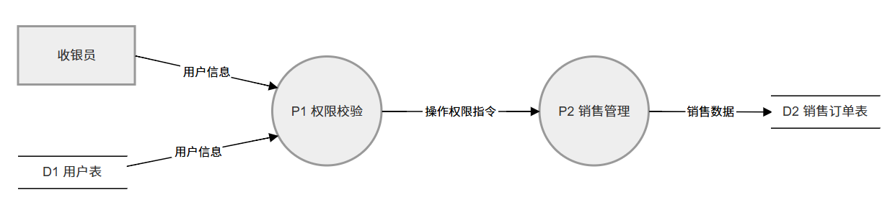

图3.5 销售管理 0 层数据流图

**数据流图的分析过程**

### 3.4.1.2细化后的1层数据流图

在所有的数据处理过程中，P2 处理过程最为核心，它根据药店操作人员的实际业务操作分成三种核心场景，根据需求，细化后的 1 层数据流图如图 3.6、图 3.7、图 3.8 所示：

1\. 销售开单1层数据流图

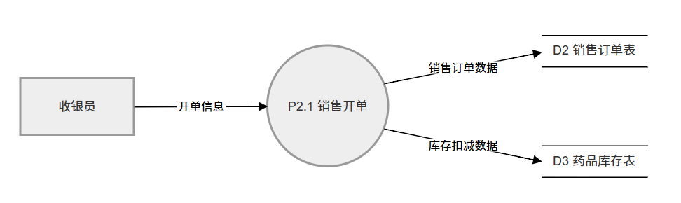

图3.6 P2 细化后销售开单数据流图

2\. 处方审核 1层数据流图

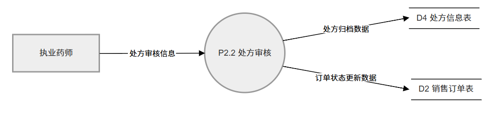

图3.7 P2 细化后处方审核数据流图

3\. 销售退货1层数据流

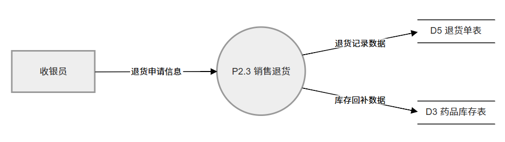

图3.8 P2 细化后销售退货数据流图

4\. 销售统计查询1 层数据流图

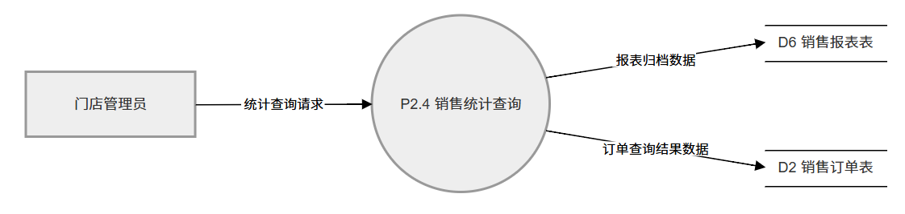

图3.9 P2 细化后销售统计查询数据流图

### 3.2.1.3 数据流描述

表3.1 用户信息数据流

| 模块名称                                                                                                    | 库存管理 | 编号 | F1  |
|-------------------------------------------------------------------------------------------------------------|----------|------|-----|
| 名称                                                                                                        | 用户信息 |      |     |
| 来源：用户表                                                                                                |          |      |     |
| 去处：进行权限校验和库存业务操作                                                                            |          |      |     |
| 数据流结构：用户信息 ={用户名 + 用户密码 + 用户编号 + 用户姓名 + 岗位 + 联系方式 + 权限等级 + 所属门店}     |          |      |     |
| 简要说明： 这些信息是仓库管理人员的必要信息，用于操作人员的身份登录验证、操作权限分配与库存业务操作权限校验 |          |      |     |

表3.2 入库单信息数据流

| 模块名称                                                                                                                                               | 库存管理   | 编号 | F2  |
|--------------------------------------------------------------------------------------------------------------------------------------------------------|------------|------|-----|
| 名称                                                                                                                                                   | 入库单信息 |      |     |
| 来源：仓库管理员 / 供应商                                                                                                                              |            |      |     |
| 去处：药品入库处理、入库单表、药品库存表                                                                                                               |            |      |     |
| 数据流结构：入库单信息 ={入库单编号 + 药品编号 + 药品名称 + 规格 + 单位 + 数量 + 批号 + 生产日期 + 有效期 + 供应商编号 + 入库日期 + 操作人 + 审核状态} |            |      |     |
| 简要说明：包含药品入库的全量核心信息，用于入库单创建、审核、库存数量更新，同时实现药品入库全流程可追溯                                                 |            |      |     |

表3.3 出库单信息数据流

| 模块名称                                                                                                                                        | 库存管理   | 编号 | F3  |
|-------------------------------------------------------------------------------------------------------------------------------------------------|------------|------|-----|
| 名称                                                                                                                                            | 出库单信息 |      |     |
| 来源：仓库管理员 / 销售系统                                                                                                                     |            |      |     |
| 去处：药品出库处理、出库单表、药品库存表                                                                                                        |            |      |     |
| 数据流结构：出库单信息 ={出库单编号 + 药品编号 + 药品名称 + 规格 + 单位 + 数量 + 批号 + 关联销售单号 + 出库类型 + 出库日期 + 操作人 + 审核状态} |            |      |     |
| 简要说明：包含药品出库的全量核心信息，用于出库单创建、审核、库存数量扣减，严格遵循 “先进先出、近效期先出” 原则，实现药品出库流向可追溯          |            |      |     |

表3.4 盘点单信息数据流

| 模块名称                                                                                                                                      | 库存管理   | 编号 | F4  |
|-----------------------------------------------------------------------------------------------------------------------------------------------|------------|------|-----|
| 名称                                                                                                                                          | 盘点单信息 |      |     |
| 来源：仓库管理员                                                                                                                              |            |      |     |
| 去处：药品入库处理、入库单表、药品库存表                                                                                                      |            |      |     |
| 数据流结构：盘点单信息 ={盘点单编号 + 药品编号 + 药品名称 + 系统库存数量 + 实际库存数量 + 差异数量 + 差异原因 + 盘点日期 + 盘点人 + 审核状态} |            |      |     |
| 简要说明：包含库存盘点的全量核心信息，用于账实核对、差异分析、库存数据调整，确保系统库存与实际库存一致                                        |            |      |     |

表3.5 库存预警信息数据流

| 模块名称                                                                                                         | 库存管理     | 编号 | F5  |
|------------------------------------------------------------------------------------------------------------------|--------------|------|-----|
| 名称                                                                                                             | 库存预警信息 |      |     |
| 来源：库存预警处理                                                                                               |              |      |     |
| 去处：仓库管理员                                                                                                 |              |      |     |
| 数据流结构：库存预警信息 ={药品编号 + 药品名称 + 预警类型 + 预警内容 + 触发时间 + 处理状态}                      |              |      |     |
| 简要说明：包含库存异常的提醒信息，覆盖低库存、高库存、近效期、过期药品四类预警，用于提醒管理人员及时处理库存风险 |              |      |     |

表3.6 库存查询统计请求数据流

| 模块名称                                                                                                   | 库存管理         | 编号 | F6  |
|------------------------------------------------------------------------------------------------------------|------------------|------|-----|
| 名称                                                                                                       | 库存查询统计请求 |      |     |
| 来源：仓库管理员 / 财务系统                                                                                |                  |      |     |
| 去处：库存查询统计处理                                                                                     |                  |      |     |
| 数据流结构：查询统计请求 ={查询条件 + 统计维度 + 时间范围 + 导出需求}                                      |                  |      |     |
| 简要说明：包含库存数据查询、统计、报表生成的请求信息，用于精准获取库存流水、库存结构、库存周转率等相关数据 |                  |      |     |

表3.7 库存查询统计结果数据流

| 模块名称                                                                                | 库存管理         | 编号 | F6  |
|-----------------------------------------------------------------------------------------|------------------|------|-----|
| 名称                                                                                    | 库存查询统计结果 |      |     |
| 来源：库存查询统计处理                                                                  |                  |      |     |
| 去处：仓库管理员 / 财务系统                                                             |                  |      |     |
| 数据流结构：查询统计结果 ={药品库存信息 + 出入库流水记录 + 盘点记录 + 库存统计报表数据} |                  |      |     |
| 简要说明：包含查询统计的返回结果，为库存优化、采购决策、财务对账、合规审计提供数据支撑  |                  |      |     |

### 3.2.1.4 数据存储描述

表3.8 用户表数据存储

| 模块名称                                                                                               | 商品管理 | 编号 | D1  |
|--------------------------------------------------------------------------------------------------------|----------|------|-----|
| 名称                                                                                                   | 用户表   |      |     |
| 组织形式：按用户编号顺序排练                                                                           |          |      |     |
| 关键字：用户编号                                                                                       |          |      |     |
| 记录组成：{用户编号 + 用户名 + 登录密码 + 用户姓名 + 岗位 + 权限等级 + 所属门店 + 联系方式 + 创建时间} |          |      |     |
| 简要说明：存储库存管理相关操作人员的基础信息与权限信息，用于操作人员的身份登录校验与业务操作权限管控   |          |      |     |

表3.9 商品表存储

| 模块名称                                                                                                                                                                 | 采商品管理 | 编号 | D2  |
|--------------------------------------------------------------------------------------------------------------------------------------------------------------------------|------------|------|-----|
| 名称                                                                                                                                                                     | 药品库存表 |      |     |
| 组织形式：按药品编号 + 批号顺序排列                                                                                                                                      |            |      |     |
| 关键字：药品编号 + 批号                                                                                                                                                  |            |      |     |
| 记录组成：{药品编号 + 药品名称 + 通用名 + 规格 + 单位 + 库存数量 + 批号 + 生产日期 + 有效期 + 生产厂家 + 供应商编号 + 货架位置 + 最低库存阈值 + 最高库存阈值 + 库存状态} |            |      |     |
| 简要说明：存储药店所有药品的实时库存核心数据，是库存管理模块的核心基础表，支撑药品出入库、盘点、预警等全流程业务                                                         |            |      |     |

表3.10 入库单表数据存储

| 模块名称                                                                                                                                       | 商品管理 | 编号 | D3  |
|------------------------------------------------------------------------------------------------------------------------------------------------|----------|------|-----|
| 名称                                                                                                                                           | 入库单表 |      |     |
| 组织形式：按入库单编号 + 入库日期顺序排列                                                                                                      |          |      |     |
| 关键字：入库单编号                                                                                                                             |          |      |     |
| 记录组成：{入库单编号 + 药品编号 + 数量 + 批号 + 生产日期 + 有效期 + 供应商编号 + 采购订单编号 + 入库日期 + 操作人 + 审核人 + 审核状态 + 备注} |          |      |     |
| 简要说明：存储所有药品入库的全流程记录，关联供应商与采购订单信息，实现药品入库环节的全链路可追溯                                               |          |      |     |

表3.11 出库单表数据存储

| 模块名称                                                                                                                 | 采商品管理 | 编号 | D4  |
|--------------------------------------------------------------------------------------------------------------------------|------------|------|-----|
| 名称                                                                                                                     | 出库单表   |      |     |
| 组织形式：按出库单编号 + 出库日期顺序排列                                                                                |            |      |     |
| 关键字：出库单编号                                                                                                       |            |      |     |
| 记录组成：{出库单编号 + 药品编号 + 数量 + 批号 + 关联销售单号 + 出库类型 + 出库日期 + 操作人 + 审核人 + 审核状态 + 备注} |            |      |     |
| 简要说明：存储所有药品出库的全流程记录，关联销售订单信息，严格遵循先进先出、近效期先出原则，实现药品出库流向的可追溯管控 |            |      |     |

表3.12 盘点单表数据存储

| 模块名称                                                                                                                                     | 商品管理 | 编号 | D5  |
|----------------------------------------------------------------------------------------------------------------------------------------------|----------|------|-----|
| 名称                                                                                                                                         | 盘点单表 |      |     |
| 组织形式：按盘点单编号 + 盘点日期顺序排列                                                                                                    |          |      |     |
| 关键字：盘点单编号                                                                                                                           |          |      |     |
| 记录组成：{盘点单编号 + 药品编号 + 系统库存数量 + 实际库存数量 + 差异数量 + 差异原因 + 盘点日期 + 盘点人 + 审核人 + 审核状态 + 库存调整状态} |          |      |     |
| 简要说明：存储库存盘点的全流程数据，记录系统库存与实际库存的账实差异及调整情况，确保库存数据的准确性与一致性                                 |          |      |     |

表3.13 药品批次表数据存储

| 模块名称                                                                                                           | 采商品管理 | 编号 | D6  |
|--------------------------------------------------------------------------------------------------------------------|------------|------|-----|
| 名称                                                                                                               | 药品批次表 |      |     |
| 组织形式：按药品编号 + 批号顺序排列                                                                                |            |      |     |
| 关键字：药品编号 + 批号                                                                                            |            |      |     |
| 记录组成：{药品编号 + 批号 + 生产日期 + 有效期 + 生产厂家 + 供应商编号 + 关联入库单号 + 批次库存数量 + 批次状态}   |            |      |     |
| 简要说明：专门存储药品的批次与效期全生命周期信息，支撑近效期、过期药品的预警与管控，满足医药行业批次追溯的合规要求 |            |      |     |

### 3.2.1.5处理描述

表3.14 权限校验处理

| 模块名称                                                               | 库存管理     | 编号 | P1  |
|------------------------------------------------------------------------|--------------|------|-----|
| 名称                                                                   | 权限校验处理 |      |     |
| 输入：用户信息                                                         |              |      |     |
| 输出：操作权限指令                                                     |              |      |     |
| 处理过程：验证操作人员身份与操作权限                                   |              |      |     |
| 简要说明：录入仓库管理人员信息进行身份校验，为库存业务操作提供权限支撑 |              |      |     |

表3.15 库存管理处理

| 模块名称                                                                     | 库存管理     | 编号 | P2  |
|------------------------------------------------------------------------------|--------------|------|-----|
| 名称                                                                         | 库存管理处理 |      |     |
| 输入：操作权限指令，库存业务数据                                             |              |      |     |
| 输出：库存更新数据，业务处理结果                                             |              |      |     |
| 处理过程：药品入库，药品出库，库存盘点，库存预警，批次效期管理，库存查询统计 |              |      |     |
| 简要说明：由仓库管理人员对药店药品库存进行全流程业务维护与管控               |              |      |     |

表3.16 药品入库处理

| 模块名称                                                       | 库存管理     | 编号 | P2.1 |
|----------------------------------------------------------------|--------------|------|------|
| 名称                                                           | 药品入库处理 |      |      |
| 输入：入库单信息                                               |              |      |      |
| 输出：库存更新数据，入库记录数据                               |              |      |      |
| 处理过程：核验药品资质，录入批次效期，审核入库单，更新库存数据 |              |      |      |
| 简要说明：完成药品入库全流程操作，更新库存并留存入库追溯记录   |              |      |      |

表 3.17 药品出库处理

| 模块名称                                                         | 库存管理     | 编号 | P2.2 |
|------------------------------------------------------------------|--------------|------|------|
| 名称                                                             | 药品出库处理 |      |      |
| 输入：出库单信息                                                 |              |      |      |
| 输出：库存扣减数据，出库记录数据                                 |              |      |      |
| 处理过程：关联出库需求，匹配药品批次，审核出库单，扣减库存数据   |              |      |      |
| 简要说明：完成药品出库全流程操作，扣减库存并留存出库流向追溯记录 |              |      |      |

表3.18 库存盘点处理

| 模块名称                                                         | 库存管理     | 编号 | P2.1 |
|------------------------------------------------------------------|--------------|------|------|
| 名称                                                             | 库存盘点处理 |      |      |
| 输入：盘点实存数据                                               |              |      |      |
| 输出：库存调整数据，盘点记录数据                                 |              |      |      |
| 处理过程：生成库存快照，录入实存数据，核算账实差异，调整库存数据 |              |      |      |
| 简要说明：完成药品库存盘点操作，确保账实相符，留存盘点全流程记录 |              |      |      |

表 3.19 库存预警处理

| 模块名称                                                         | 库存管理     | 编号 | P2.2 |
|------------------------------------------------------------------|--------------|------|------|
| 名称                                                             | 库存预警处理 |      |      |
| 输入：库存数据，批次效期数据                                     |              |      |      |
| 输出：库存预警信息                                               |              |      |      |
| 处理过程：扫描库存数据，匹配预警规则，生成预警信息，推送管理人员 |              |      |      |
| 简要说明：实时监控库存状态，防范库存积压、短缺及药品过期风险     |              |      |      |

表3.20 批次效期管理处理

| 模块名称                                                         | 库存管理         | 编号 | P2.1 |
|------------------------------------------------------------------|------------------|------|------|
| 名称                                                             | 批次效期管理处理 |      |      |
| 输入：药品批次信息                                               |                  |      |      |
| 输出：批次状态更新数据，效期提醒信息                             |                  |      |      |
| 处理过程：登记批次信息，更新批次状态，效期自动提醒，过期批次锁定 |                  |      |      |
| 简要说明：实现药品批次与效期全流程管控，满足医药行业合规追溯要求 |                  |      |      |

表 3.21 库存查询统计处理

| 模块名称                                                             | 库存管理         | 编号 | P2.2 |
|----------------------------------------------------------------------|------------------|------|------|
| 名称                                                                 | 库存查询统计处理 |      |      |
| 输入：库存查询统计请求                                               |                  |      |      |
| 输出：库存查询统计结果                                               |                  |      |      |
| 处理过程：解析查询条件，提取业务数据，生成统计报表，返回查询结果     |                  |      |      |
| 简要说明：提供多维度库存数据查询统计服务，为库存优化决策提供数据支撑 |                  |      |      |

# 第四章 概要设计

概要设计是一个设计师根据用户交互过程和用户需求来形成交互框架和视觉框架的过程，其结果往往以反映交互控件布置、界面元素分组以及界面整体板式的页面框架图的形式来呈现。这是一个在用户研究和设计之间架起桥梁，使用户研究和设计无缝结合，将对用户目标与需求转换成具体界面设计解决方案的重要阶段。

概要设计的主要任务是把需求分析得到的系统扩展用例图转换为软件结构和数据结构。设计软件结构的具体任务是：将一个复杂系统按功能进行模块划分、建立模块的层次结构及调用关系、确定模块间的接口及人机界面等。数据结构设计包括数据特征的描述、确定数据的结构特性、以及数据库的设计。显然，概要设计建立的是目标系统的逻辑模型，与计算机无关。

### 4.1药店药品进销管理系统模块划分

药店药品进销管理系统设计中有很多个模块，经过整合协商得出系统总体用例图如图4.1.1所示。

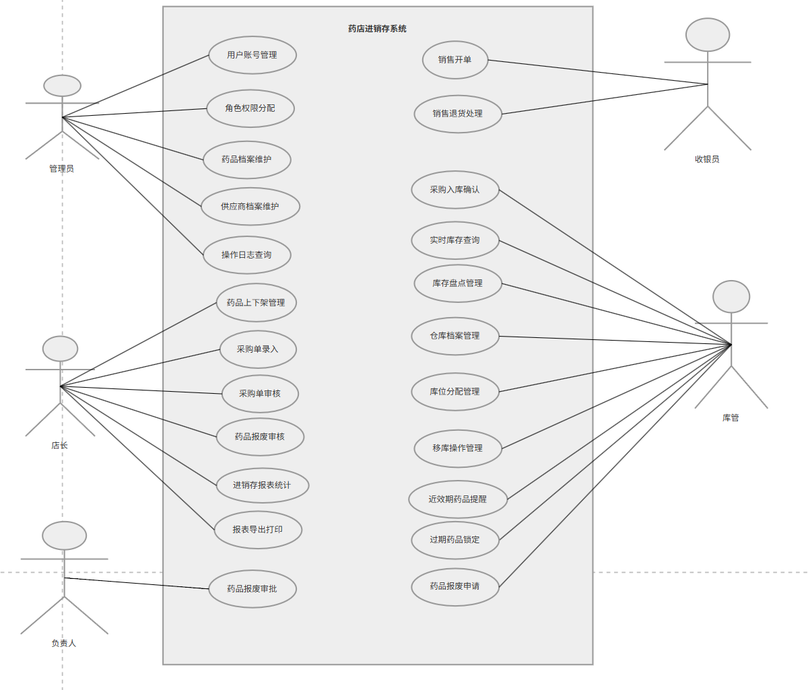

图4.1.1 系统用例图

我负责的模块是库存管理模块及销售管理模块其中库存管理模块包括药品入库管理，药品出库管理，库存盘点管理，库存预警管理，药品批次与效期管理，库存查询与统计分析；销售管理模块包括前台销售开单管理，销售订单与追溯管理，处方药销售合规管理，医保与会员销售管理，销售退货与售后管理，销售数据查询与统计分析。库存管理模块总体用例图如图4.1.2所示

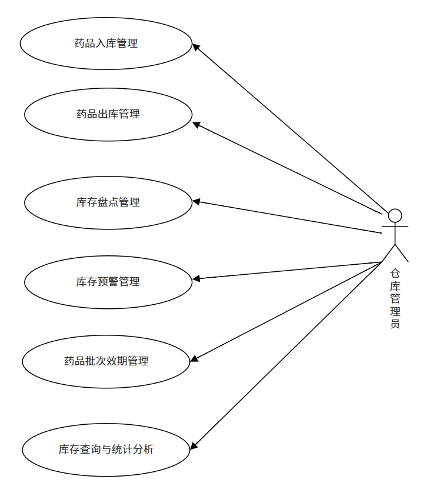

图4.1.2 库存管理用例图

### 4.1.1药品入库管理子模块

药品入库管理是药店库存数据合法新增的唯一合规入口，覆盖采购入库、顾客退货入库等核心场景，负责入库药品资质核验、批次与效期信息录入、入库单审核流转，审核通过后自动更新库存数据，确保入库药品全链路可追溯。

药品入库管理用例图：

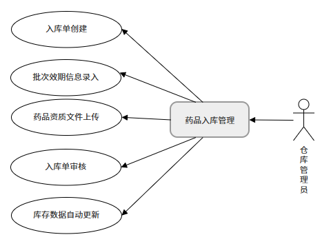

图4.1.3 药品入库管理用例图

### 4.1.2药品出库管理子模块

药品出库管理是药店库存数据合规扣减的核心环节，覆盖销售出库、门店调拨出库、破损/过期药品报损出库等场景，严格遵循 “先进先出、近效期先出” 原则自动匹配药品批次，完成出库单审核后自动扣减对应库存，实现药品出库流向全流程可追溯。

药品出库管理用例图

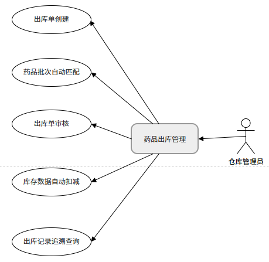

图4.1.4 药品出库管理用例图

### 4.1.3库存盘点子模块

库存盘点管理是保障药店库存 “账实相符” 的核心手段，支持全品类全盘、指定品类/货架抽盘两种模式，可生成盘点时刻的库存快照、自动核算系统库存与实盘数据的差异，经审批后完成库存数据调整，留存完整盘点记录，确保库存数据的准确性。

库存盘点用例图

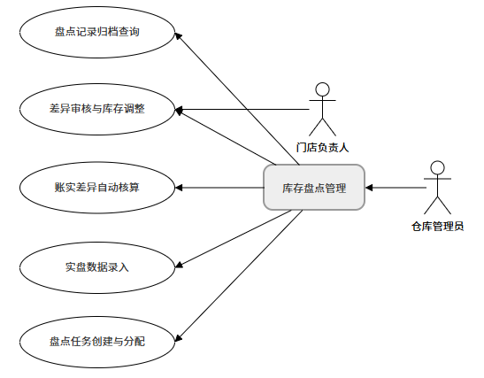

图4.1.5 库存盘点用例图

### 4.1.4库存预警管理子模块

库存预警管理是防范药店库存经营风险的核心功能，通过预设预警规则与阈值，实现最低库存短缺预警、最高库存积压预警、近效期药品预警、过期药品锁定预警的多维度监控，实时向管理人员推送预警信息，避免药品短缺、积压与过期损耗。

库存预警管理用例图

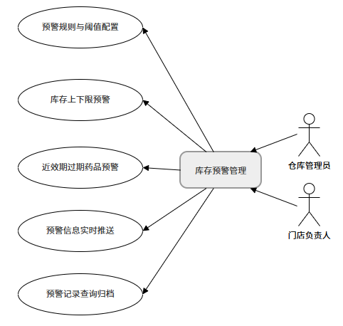

图4.1.6 库存预警管理用例图

### 4.1.5药品批次与效期管理子模块

药品批次与效期管理是满足医药行业 GSP 合规要求的核心模块，对药品实行 “一物一批号” 的精细化管理，实现药品批次从入库到出库的全链路追溯、效期自动监控、近效期提醒、过期批次自动锁定，全程保障药品质量安全与经营合规性。

药品批次与效期管理用例图

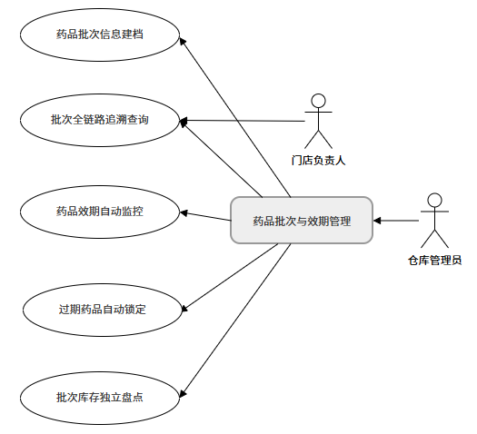

图4.1.7 库存预警管理用例图

### 4.1.6库存查询与统计分析子模块

库存查询与统计分析是为药店库存优化、采购决策提供数据支撑的核心功能，支持多维度实时库存查询、库存变动流水全流程追溯，可自动生成库存周转率、库存结构、积压 / 近效期药品统计等报表，助力门店实现库存精细化运营。

药品批次与效期管理用例图

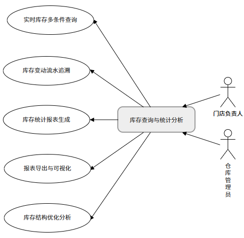

图4.1.8 库存预警管理用例图

## 4.2 药店药品进销管理系统设计的销售管理模块

销售管理模块的用例图如图4.2.1所示

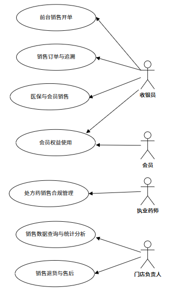

图4.2.1 销售管理模块的用例图

### 4.2.1前台销售开单管理子模块

前台销售开单管理是药店零售业务的核心入口，覆盖扫码 / 检索开单、挂单取单、金额自动核算、多方式支付结算、单据打印等全流程，是连接顾客消费与库存扣减的核心环节，保障收银环节高效、准确完成。

前台销售开单管理用例图：

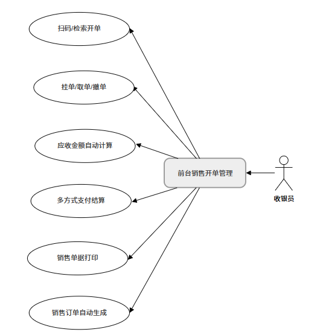

图4.2.2 前台销售开单管理用例图

### 4.2.2销售订单与追溯管理子模块

销售订单与追溯管理是实现药店销售全链路可追溯的核心模块，支持订单多维度查询、订单状态全流程跟踪、药品销售批次反向追溯、异常订单闭环处理，满足 GSP 规范对药品流向追溯的强制要求，同时支撑售后业务的合规开展。

销售订单与追溯管理用例图

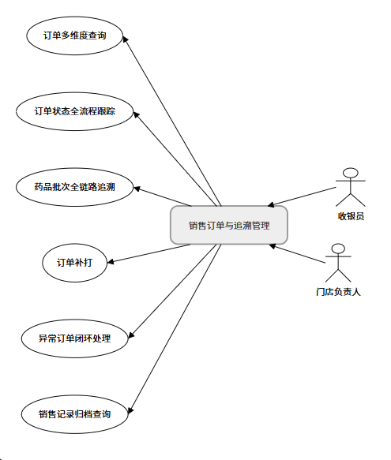

图4.2.3 销售订单与追溯管理用例图

### 4.2.3处方药销售合规管理子模块

处方药销售合规管理是满足医药行业监管要求的核心模块，覆盖处方信息上传留存、执业药师在线审核、处方核销管控、特殊药品实名登记等核心功能，严格落实处方药销售 “先审方、后销售” 的合规要求，保障药店经营合规性。

处方药销售合规管理用例图

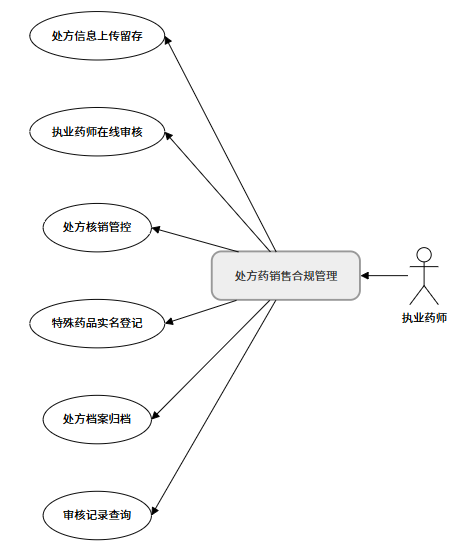

图4.2.4 处方药销售合规管理用例图

### 4.2.4医保与会员销售管理子模块

医保与会员销售管理是提升药店服务能力与顾客粘性的核心模块，支持参保人员身份核验、医保目录自动匹配、医保费用合规拆分、会员信息识别、会员折扣 / 积分自动核算，兼顾医保结算的合规性与会员运营的灵活性。

商品修改用例图

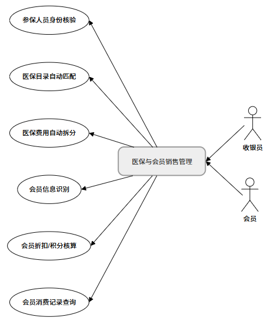

图4.2.5 医保与会员销售管理用例图

### 4.2.5销售退货与售后管理子模块

销售退货与售后管理是药店售后业务合规管控的核心环节，覆盖关联原单的退货申请、退货药品资质与效期核验、退款金额核算、合规药品库存回补、售后投诉闭环处理，严格管控退货风险，保障库存数据准确与顾客权益。

销售退货与售后管理用例图

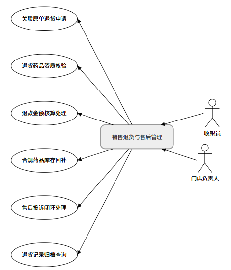

图4.2.6 销售退货与售后管理用例图

### 4.2.6销售数据查询与统计分析子模块

销售数据查询与统计分析是为药店经营决策提供数据支撑的核心模块，支持实时销售流水查询、多维度销售报表自动生成、药品销售排行与人员业绩统计、报表导出与可视化展示，助力门店优化品类结构、提升经营效益。

销售数据查询与统计分析用例图

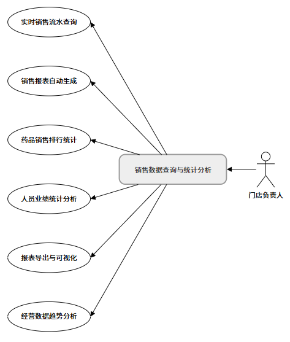

图4.2.7 销售数据查询与统计分析用例图

## 4.3数据库设计

[数据库设计](http://baike.baidu.com/item/%E6%95%B0%E6%8D%AE%E5%BA%93%E8%AE%BE%E8%AE%A1)(Database Design)是指对于一个给定的应用环境，构造最优的数据库模式，建立[数据库及其应用](http://baike.baidu.com/item/%E6%95%B0%E6%8D%AE%E5%BA%93%E5%8F%8A%E5%85%B6%E5%BA%94%E7%94%A8)系统，使之能够有效地[存储数据](http://baike.baidu.com/item/%E5%AD%98%E5%82%A8%E6%95%B0%E6%8D%AE)，满足各种用户的应用需求（信息要求和处理要求）。在数据库领域内，常常把使用数据库的各类系统统称为[数据库应用系统](http://baike.baidu.com/item/%E6%95%B0%E6%8D%AE%E5%BA%93%E5%BA%94%E7%94%A8%E7%B3%BB%E7%BB%9F)。

### 4.3.1概念结构设计

概念结构设计的任务是在需求分析阶段产生的需求说明书的基础上，按照特定的方法把它们抽象为一个不依赖于任何具体机器的数据模型，即概念模型。概念模型使设计者的注意力能够从复杂的实现细节中解脱出来，而只集中在最重要的信息的组织结构和处理模式上。

概念数据模型,主要在系统开发的数据库设计阶段使用,是按照用户的观点来对数据和信息进行建模,利用实体关系图来实现.它描述系统中的各个实体以及相关实体之间的关系,是系统特性和静态描述.数据字典也将是系统进一步开发的基础。

通过分析整理相关关系见图4.6

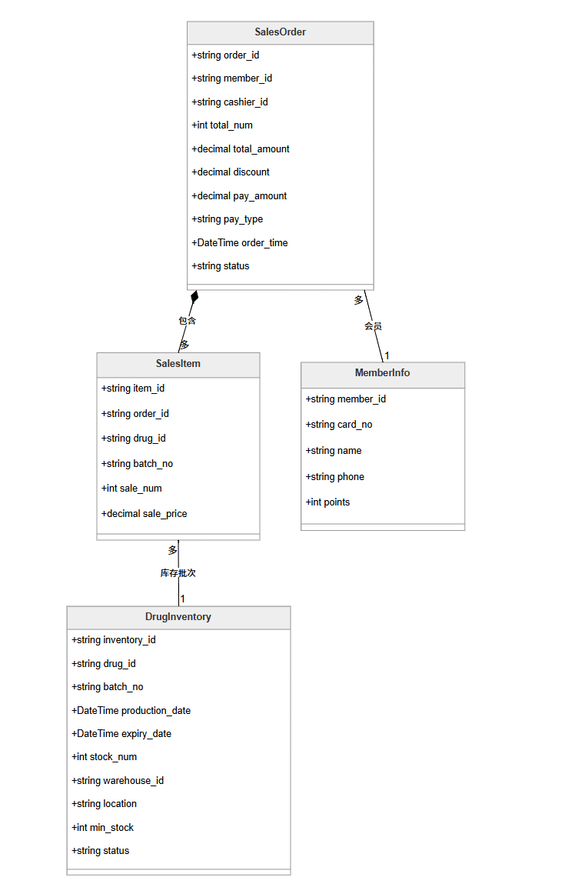

图4.6库存管理和销售管理类图

类关系,描述

### 4.3.2 逻辑结构设计

逻辑结构设计是将概念结构设计阶段所得到的[概念模型](http://baike.baidu.com/item/%E6%A6%82%E5%BF%B5%E6%A8%A1%E5%9E%8B)转换为具体DBMS所能支持的数据模型（即逻辑结构），并对其进行优化。

### 1. 药品库存（库存 ID，药品 ID，批号，生产日期，有效期，库存数量，仓库 ID，货架位置，最低库存预警，状态）

主键：库存 ID

函数依赖 {库存 ID-\> 其他所有属性}

由函数依赖可知，依赖左端为候选码，所以药品库存属于 BCNF

### 2. 销售订单（销售单号，会员 ID，收银员，总数量，应收金额，优惠，实收金额，支付方式，订单时间，状态）

主键：销售单号

函数依赖 {销售单号 -\> 其他所有属性}

由函数依赖可知，依赖左端为候选码，所以销售订单属于 BCNF

### 3. 销售明细（明细 ID，销售单号，药品 ID，批号，销售数量，销售价格）

主键：明细 ID

函数依赖 {明细 ID-\> 其他所有属性}

由函数依赖可知，依赖左端为候选码，所以销售明细属于 BCNF

### 4. 会员信息（会员 ID，会员卡号，姓名，联系方式，积分）

主键：会员 ID

函数依赖 {会员 ID-\> 其他所有属性}

由函数依赖可知，依赖左端为候选码，所以会员信息属于 BCNF

### 4.3.3物理结构设计

为给定的逻辑数据模型选取一个最合适应用要求的物理结构的过程就是数据库的物理设计。物理设计时要确定数据库的存储路径，数据规模等，在数据库管理系统中创建数据库，建立数据库的所有数据模式。

本系统数据库充分考虑了数据表的划分及其之间的联系，在保障数据流向简明、查询效率较高的前提下，设计了如下数据库表结构：

1，药品库存表（drug_inventory）

表4.1 药品库存表

Table4.1 drug_inventory table

| **字段名**      | **字段解释**    | **类型**    | **是否可空** |
|-----------------|-----------------|-------------|--------------|
| inventory_id    | 库存 ID（主键） | VARCHAR(32) | Not null     |
| drug_id         | 药品 ID         | VARCHAR(32) | Not null     |
| batch_no        | 批号            | VARCHAR(50) | Not null     |
| production_date | 生产日期        | DATE        | null         |
| expiry_date     | 有效期          | DATE        | Not null     |
| stock_num       | 库存数量        | INT         | Not null     |
| warehouse_id    | 仓库 ID         | VARCHAR(32) | null         |
| location        | 货架位置        | VARCHAR(50) | null         |
| min_stock       | 最低库存预警    | INT         | null         |
| status          | 状态            | VARCHAR(20) | null         |

说明：药品库存表是对药品库存批次及数量信息的描述

2，销售订单表（sales_order）

表4.2 销售订单表

Table4.2 sales_order table

| **字段名**   | **字段解释**     | **类型**      | **是否可空** |
|--------------|------------------|---------------|--------------|
| order_id     | 销售单号（主键） | VARCHAR(32)   | Not null     |
| member_id    | 会员 ID          | VARCHAR(32)   | null         |
| cashier_id   | 收银员           | VARCHAR(32)   | Not null     |
| total_num    | 总数量           | INT           | Not null     |
| total_amount | 应收金额         | DECIMAL(12,2) | Not null     |
| discount     | 优惠             | DECIMAL(12,2) | null         |
| pay_amount   | 实收金额         | DECIMAL(12,2) | Not null     |
| pay_type     | 支付方式         | VARCHAR(20)   | Not null     |
| order_time   | 订单时间         | DATETIME      | null         |
| status       | 状态             | VARCHAR(20)   | null         |

说明：销售订单表是对销售订单主表信息的描述

3, 销售明细表（sales_item）

表4.3 销售明细表

Table4.3 sales_item table

| **字段名** | **字段解释**    | **类型**      | **是否可空** |
|------------|-----------------|---------------|--------------|
| item_id    | 明细 ID（主键） | VARCHAR(32)   | Not null     |
| order_id   | 销售单号        | VARCHAR(32)   | Not null     |
| drug_id    | 药品 ID         | VARCHAR(32)   | Not null     |
| batch_no   | 批号            | VARCHAR(50)   | Not null     |
| sale_num   | 销售数量        | INT           | Not null     |
| sale_price | 销售价格        | DECIMAL(10,2) | Not null     |

说明：销售明细表是对销售订单具体药品明细的描述

4,会员表

表4.4 会员表

Table4.4 member_info table

| **字段名** | **字段解释**    | **类型**    | **是否可空** |
|------------|-----------------|-------------|--------------|
| member_id  | 会员 ID（主键） | VARCHAR(32) | Not null     |
| card_no    | 会员卡号        | VARCHAR(30) | Not null     |
| name       | 姓名            | VARCHAR(50) | Not null     |
| phone      | 联系方式        | VARCHAR(20) | Not null     |
| points     | 积分            | INT         | null         |

说明：会员表是对会员基本信息的描述

# 第五章 详细设计

详细设计是软件工程中软件开发的一个步骤，就是对概要设计的一个细化，就是详细设计每个模块实现算法，所需的局部结构。在详细设计阶段，主要是通过需求分析的结果，设计出满足用户需求的嵌入式系统产品。

详细设计的主要任务是设计每个模块的实现算法、所需的局部数据结构。详细设计的目标有两个：实现模块功能的算法要逻辑上正确和算法描述要简明易懂。

## 

## 5.1类图

类图一般在详细设计过程中出现，主要用来描述系统中各个模块中类之间的关系，包括类或者类与接口的继承关系，类之间的依赖、聚合等关系。它还描述每一个类的详细信息，包括变量，和方法。通过类图，就能实际的把系统中的各个类，即对象描述清楚，下一步就是按照这个详细的设计编码了。

1.  系统整体类图

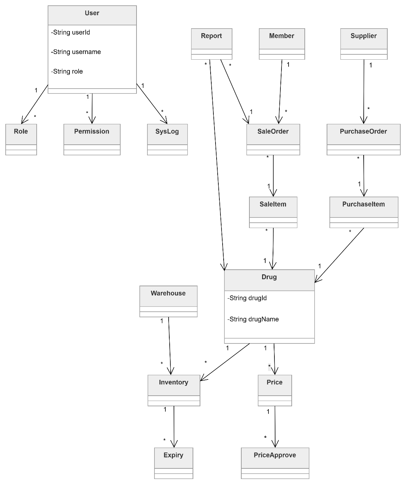

图5.1 系统总体类图

Fig.5.1 All Class diagram

2，商品管理类图

图5.2 库存管理和销售管理类图

Fig.5.2 Commodity managementClass diagram

## 5.2时序图

时序图（Sequence Diagram），亦称为序列图或循序图或顺序图，是一种UML交互图。它通过描述对象之间发送消息的时间顺序显示多个对象之间的动态协作。它可以表示用例的行为顺序，当执行一个用例行为时，时序图中的每条消息对应了一个类操作或状态机中引起转换的触发事件。

时序图描述对象是如何交互的，并且将重点放在消息序列上。也就是说，描述消息是如何在对象间发送和接收的。时序图有两个坐标轴：纵坐标轴显示时间，横坐标轴显示对象。每一个对象的表示方法是：矩形框中写有对象和 / 或类名，且名字下面有下划线；同时有一条纵向的虚线表示对象在序列中的执行情况 ( 即发送和接收的消息对象的活动 ) ， 这条虚线称为对象的生命线。对象间的通信用对象的生命线之间的水平的消息线来表示，消息线的箭头说明消息的类型，如同步，异步或简单 。 浏览时序图的方法是，从上到下查看对象间交换的消息，分析那些随着时间的流逝而发生的消息交换。

1.  前台普通药品销售开单流程时序图如图5.3所示

说明：药店最核心的日常零售业务流程，完整覆盖从药品扫码检索到小票打印的全链路，实现销售结算与库存扣减的自动联动。

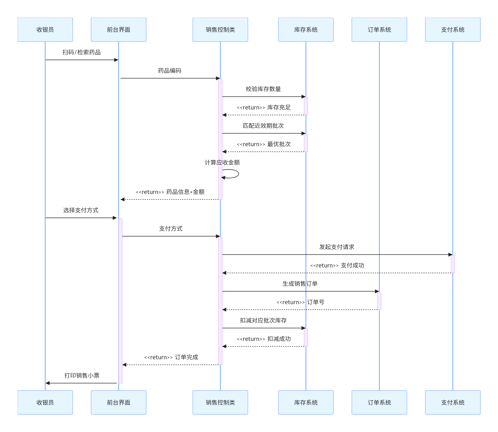

图5.3 前台普通药品销售开单流程时序图

Fig.5.3 Sequence Diagram for Over-the-Counter Drug Sales Checkout Process

2.  处方药销售审核流程时序图如图5.4所示

说明：满足医药行业 GSP 强制合规要求的核心流程，严格落实 "先审方、后销售" 原则，全程留存处方审核记录，保障处方药销售合法性。

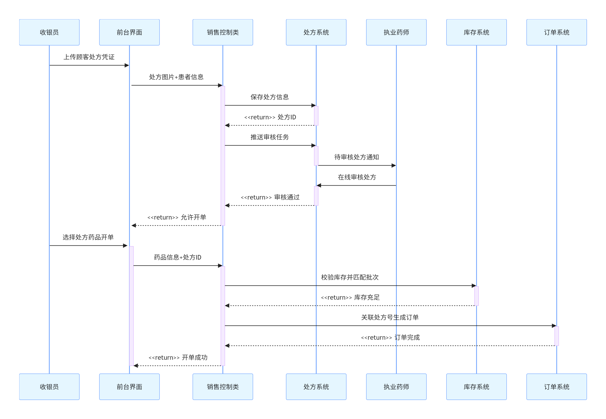

图5.4 处方药销售审核流程时序图

Fig.5.4 Sequence Diagram for Prescription Drug Sales Review Process

3，销售退货处理流程时序图如图5.5所示

说明：药店售后业务的核心闭环流程，通过关联原单核验、药品资质校验，实现退款与库存回补的精准管控，同时自动触发不合格药品报损流程。

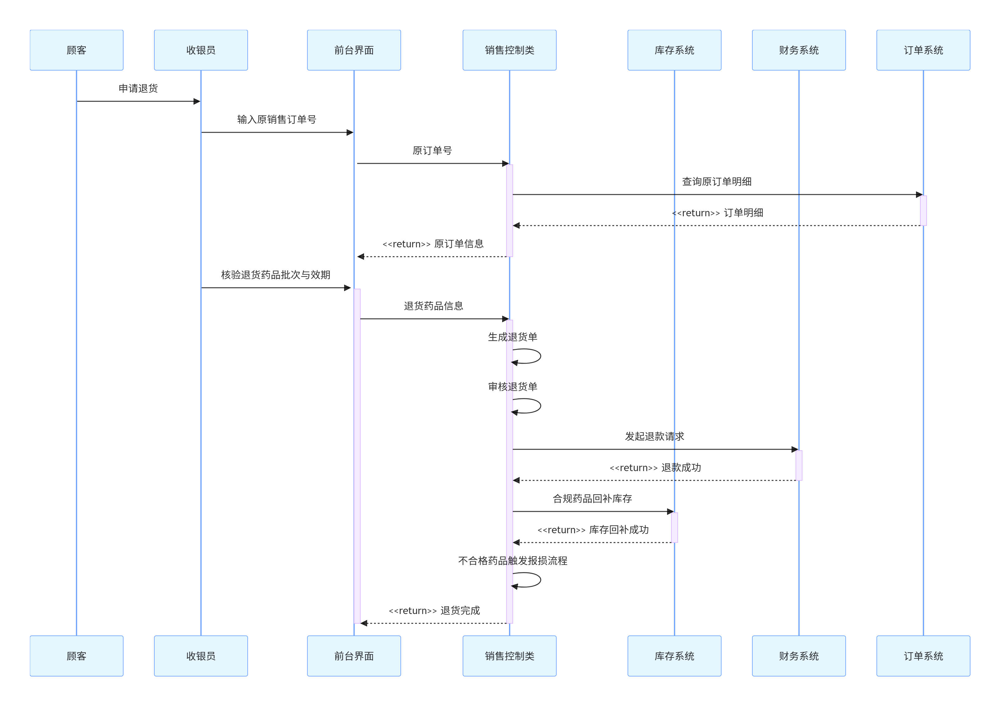

图5.5 销售退货处理流程时序图

Fig.5.5 Sequence Diagram for Sales Return Processing Process

4，药品采购入库流程时序图如图5.6所示

说明：药店库存数据合法新增的唯一合规入口，完成批次效期信息录入、资质文件上传与审核，确保入库药品全链路可追溯。

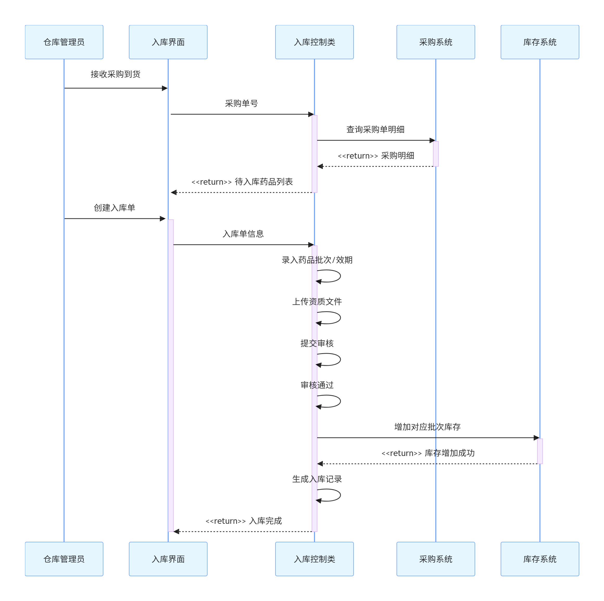

图5.6 药品采购入库流程时序图

Fig.5.6 Sequence Diagram for Drug Purchase Warehousing Process

5.  药品销售出库流程时序图如图5.7所示

说明：连接销售模块与库存模块的关键联动流程，严格遵循 "先进先出、近效期先出" 原则自动匹配药品批次，保障出库药品质量与流向可查。

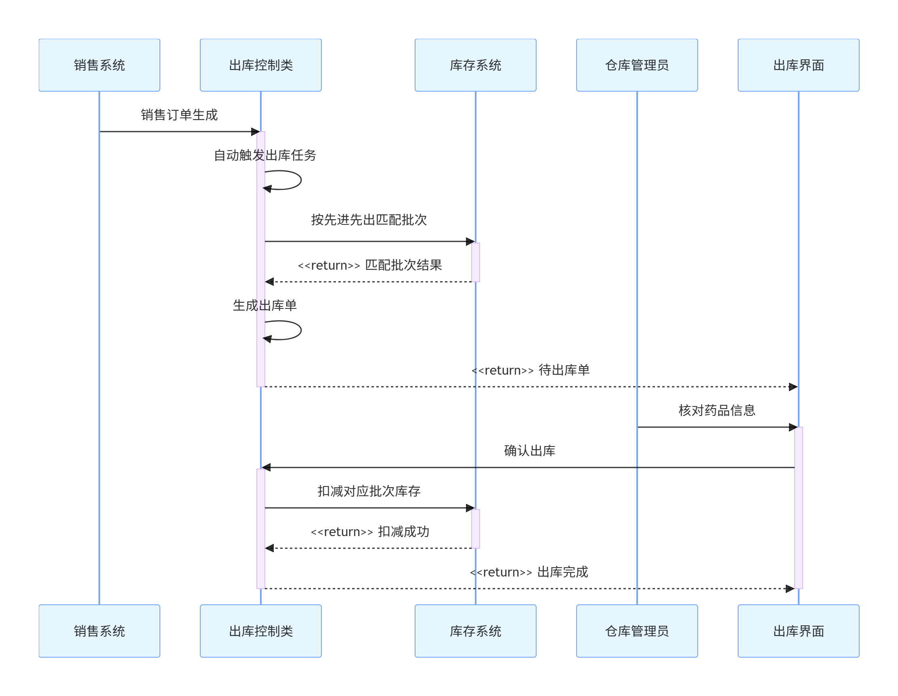

图5.7 药品销售出库流程时序图

Fig.5.7 Sequence Diagram for Drug Sales Outbound Process

6.  库存盘点与差异调整流程时序图如图5.8所示

说明：保障药店库存 "账实相符" 的核心管控流程，通过生成盘点快照、自动核算差异、分级审核调整，确保库存数据的准确性与完整性。

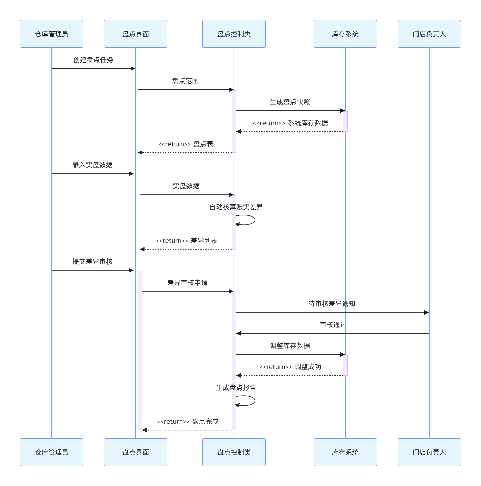

图5.8 库存盘点与差异调整流程时序图

Fig.5.8 Sequence Diagram for Inventory Stocktaking and Discrepancy Adjustment Process

7，会员结算与积分抵扣流程时序图如图5.9所示

说明：药店会员运营的核心流程，实现会员身份自动识别、折扣自动应用、积分自动抵扣与消费记录同步，提升顾客粘性与复购率。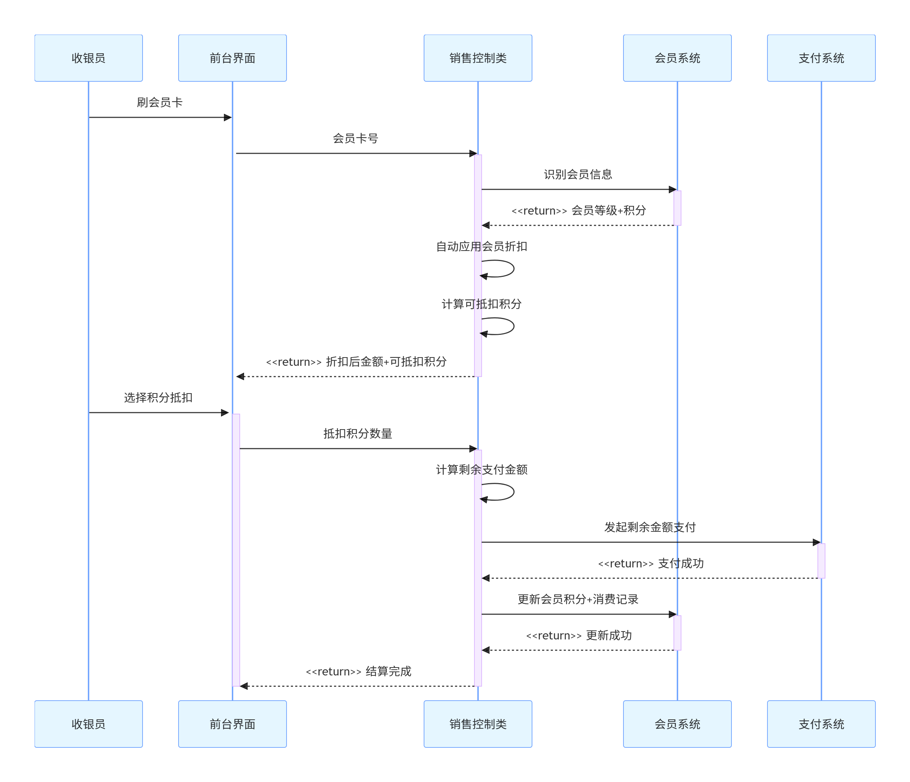

图5.9 会员结算与积分抵扣流程时序图

Fig.5.9 Sequence Diagram for Member Settlement and Points Deduction Process

8，医保刷卡结算流程时序图如图5.10所示

说明：医保定点药店的必备核心功能，自动完成参保人员身份核验、医保目录匹配与费用拆分，保障医保结算的合规性与准确性。

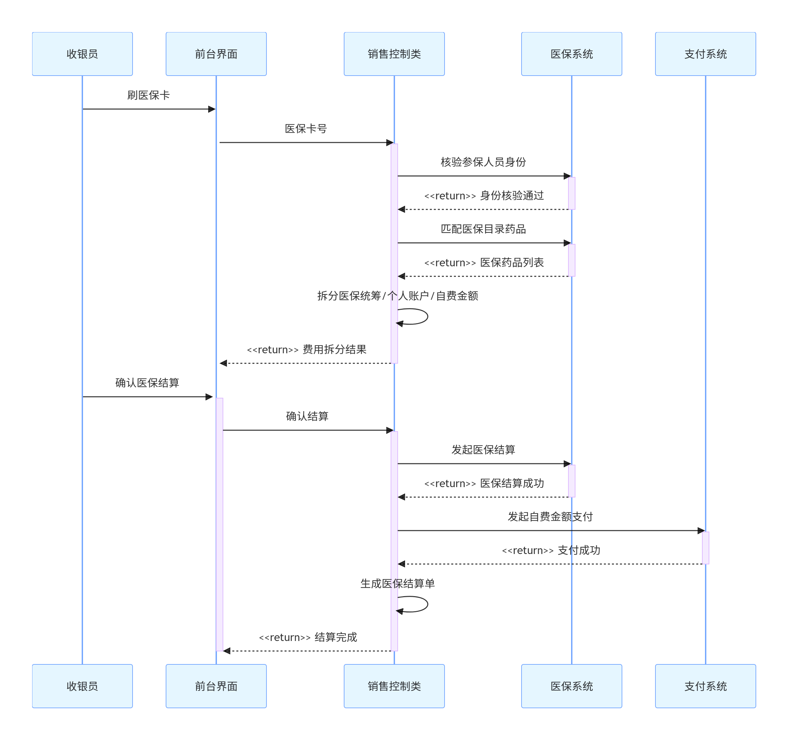

图5.10 医保刷卡结算流程时序图

Fig.5.10 Sequence Diagram for Medical Insurance Card Swipe Settlement Process

9.  药品报损出库流程时序图如图5.11所示

说明：处理破损、过期、变质药品的合规流程，通过凭证上传与分级审核管控报损风险，确保库存数据真实反映实际药品存量。

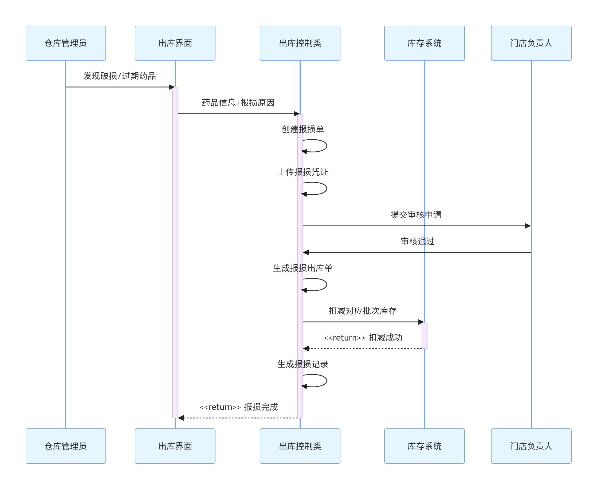

图5.11 药品报损出库流程时序图

Fig.5.11 Sequence Diagram for Drug Damage Reporting Outbound Process

10. 库存预警通知与处理流程时序图如图5.12所示

说明：主动防范药店库存经营风险的机制，定时扫描库存数据，对短缺、积压、近效期药品实时推送预警，减少药品损耗与断货损失。

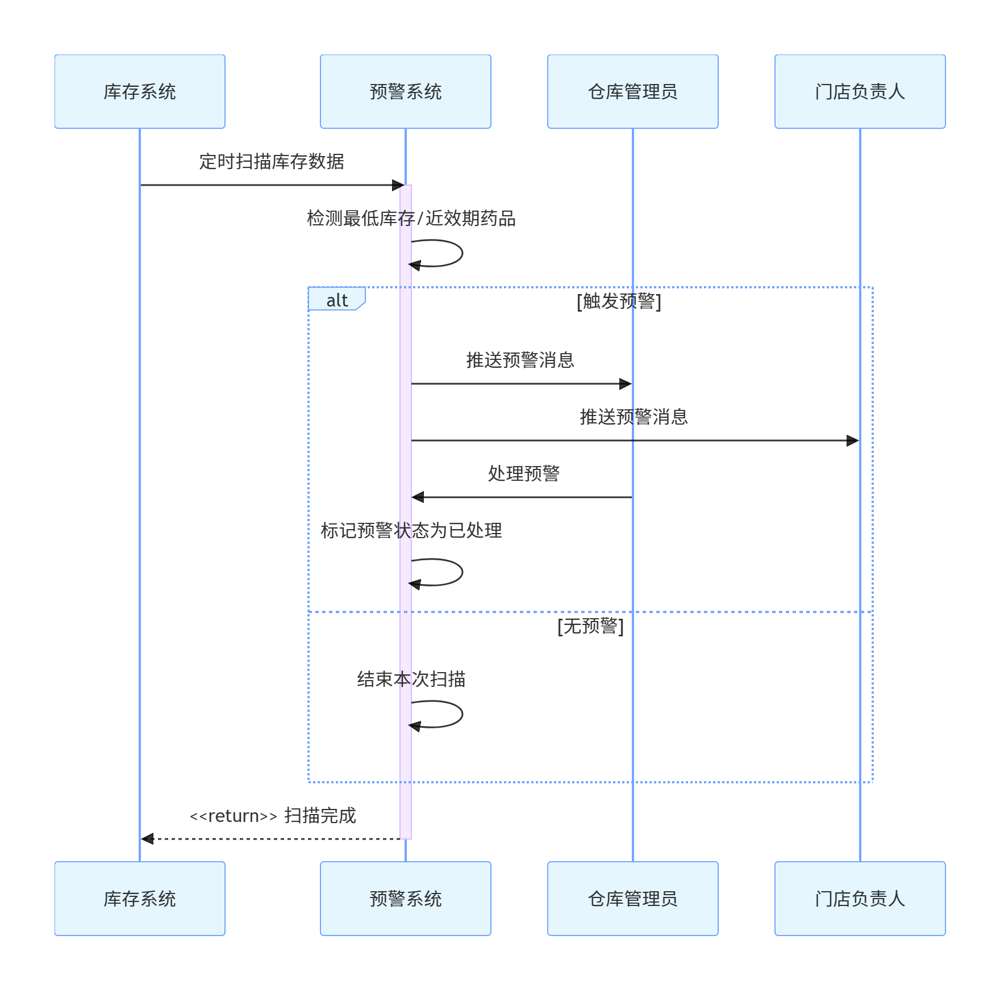

图5.12 库存预警通知与处理流程时序图

Fig.5.12 Sequence Diagram for Inventory Alert Notification and Handling Process

11，**销售订单全链路追溯流程时序图**如图5.13所示

说明：药店售后业务的核心闭环流程，通过关联原单核验、药品资质校验，实现退款与库存回补的精准管控，同时自动触发不合格药品报损流程。

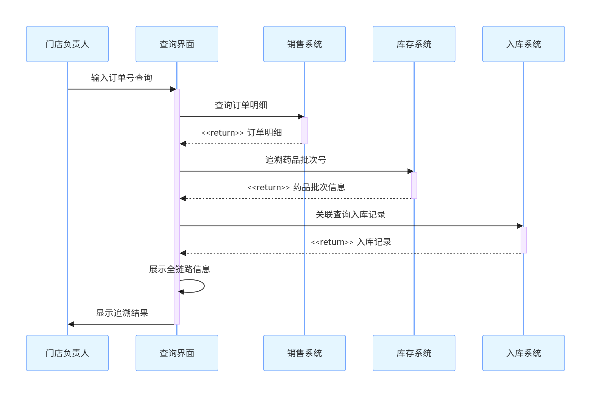

图5.13 **销售订单全链路追溯流程时序图**

Fig.5.13 Sequence Diagram for Sales Return Processing Process

12，药品过期自动锁定流程时序图如图5.14所示

说明：保障药品质量安全的自动管控机制，每日定时扫描药品效期，自动锁定过期批次库存并禁止销售，从源头杜绝过期药品流入市场。

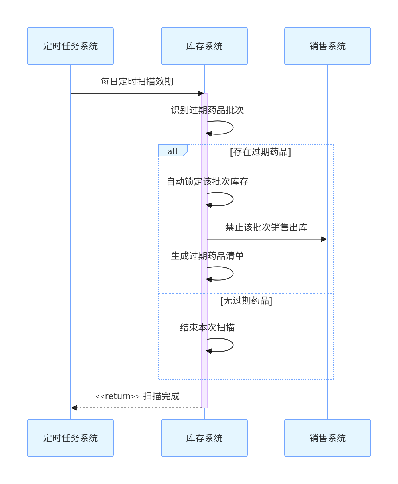

图5.14 药品过期自动锁定流程时序图

Fig.5.14 Sequence Diagram for Drug Automatic Expiration Locking Process
